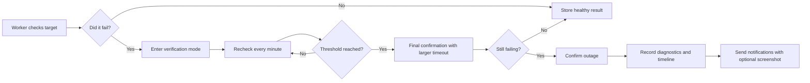

# Sentrovia

<p align="center">
  
</p>

<p align="center">
  <strong>Verification-aware monitoring for internal teams.</strong><br>
  Fewer false alarms, clearer evidence, and a clean operations console.
</p>

<p align="center">
  
  
  
  
  
</p>

## What Is Sentrovia?

Sentrovia is a self-hosted monitoring platform for websites, APIs, TCP ports, PostgreSQL endpoints, ping targets, JSON assertions, keyword checks, and heartbeat jobs.

It is built for teams that do not want an alert every time a single request times out. Sentrovia verifies failures first, records evidence, then sends notifications when an outage is confirmed.

**Good fit for:**

- Internal IT and operations teams
- Windows-heavy environments
- Teams that need PostgreSQL-backed worker state
- Operators who want alert history, delivery visibility, and HTML reports

## Highlights

| Area | What Sentrovia Does |
| --- | --- |
| ✅ Verified alerts | Rechecks failures before sending down notifications |
| 🧪 Monitor types | HTTP, keyword, JSON, TCP, PostgreSQL, ping, heartbeat |
| 📸 Evidence | Captures Chromium screenshots for confirmed HTTP-style outages |
| 📬 Notifications | Email, Telegram, Discord, and generic webhooks |
| 📊 Reports | Scheduled and manual HTML reports |
| 🌐 Status pages | Public pages for service health |
| 👥 Members | First admin onboarding, then admin-managed members |
| 🪟 Windows ready | NSSM service scripts for web and worker processes |

## Screenshots

### Dashboard and Monitoring

<table>
  <tr>
    <td width="50%">
      
    </td>
    <td width="50%">
      
    </td>
  </tr>
  <tr>
    <td><sub>Workspace health, worker state, recent activity, and system visibility.</sub></td>
    <td><sub>Monitor inventory, verification state, bulk actions, history strips, and company assignment.</sub></td>
  </tr>
</table>

### Delivery and Help

<table>
  <tr>
    <td width="50%">
      
    </td>
    <td width="50%">
      
    </td>
  </tr>
  <tr>
    <td><sub>Delivery testing, immutable history, retry visibility, and channel diagnostics.</sub></td>
    <td><sub>Built-in operational documentation for checks, workers, reports, notifications, and troubleshooting.</sub></td>
  </tr>
</table>

<p align="center">
  
</p>

## Quick Start With Docker

Docker Compose is the fastest way to run Sentrovia locally.

```bash
docker compose up --build
```

Local startup uses the default Compose files automatically. They provide development-only values for PostgreSQL, auth, encryption, web, and worker settings, so a clean local checkout can start with one command even if `.env.example` has placeholder values.

Open the app:

[http://localhost:3000](http://localhost:3000)

The stack starts:

- PostgreSQL
- Next.js web console
- Background worker
- Playwright Chromium for screenshot evidence

On first launch, Sentrovia shows onboarding and creates the first administrator. Public signup is disabled after onboarding; admins manage members from inside the app.

If PostgreSQL was already started once with a different password, the existing Docker volume keeps that old password. For a clean local reset, stop the stack and remove the local database volume:

```bash
docker compose down -v
docker compose up --build
```

Use this only for local development because it deletes the local PostgreSQL data.

## Environment

Local Docker startup works without a `.env` file because the default Compose setup provides development-only values. Production and shared servers must use explicit environment values.

```bash
POSTGRES_USER=postgres
POSTGRES_PASSWORD=example-postgres-password-change-me
POSTGRES_DB=uptimemonitoring

APP_URL=http://localhost:3000
AUTH_SECRET=example-auth-secret-change-me-32-characters-minimum
APP_ENCRYPTION_SECRET=example-encryption-secret-change-me-32-characters-minimum

WORKER_CONCURRENCY=20
WORKER_POLL_INTERVAL_MS=10000
MONITOR_ALLOW_PRIVATE_TARGETS=true
```

Production notes:

- `AUTH_SECRET` and `APP_ENCRYPTION_SECRET` must be long, random, non-placeholder values.
- `APP_URL` must match the real URL operators use.
- The web process and worker process must use the same environment values.
- Do not use `.env.example` values directly in production; copy the file and replace every placeholder.
- For production Compose, include the strict production override so missing secrets fail fast:

```bash
cp .env.example .env
# Edit .env and replace every placeholder value.
docker compose -f docker-compose.yml -f docker-compose.prod.yml up -d --build
```

- Set `AUTH_TRUST_PROXY_HEADERS=true` only behind a trusted reverse proxy that sanitizes forwarded headers.
- Use `PLAYWRIGHT_BROWSERS_PATH=0` when running Playwright Chromium from a Windows service.

## Local Development

Run PostgreSQL in Docker and the app on your machine:

```bash
docker compose up -d db
npm install
npm run db:push
npm run db:manual
npm run dev
```

Start the worker in a second terminal:

```bash
npm run worker:dev
```

Useful commands:

```bash
npm run dev
npm run build
npm run start
npm run worker:dev
npm run worker:start
npm run lint
npm run test
npm run db:push
npm run db:manual
```

## Updating Sentrovia

Sentrovia checks GitHub Releases from **Settings -> Updates**. The app never updates itself from the browser; admins run the shown commands on the host so updates stay explicit and auditable.

Local/demo Docker checkout:

```bash
git fetch --tags origin
git checkout vX.Y.Z
docker compose up -d --build
```

Production Docker Compose:

```bash
git fetch --tags origin
git checkout vX.Y.Z
docker compose -f docker-compose.yml -f docker-compose.prod.yml up -d --build
```

The Docker web service runs schema bootstrap and manual migrations during startup. These commands keep your `.env` files and PostgreSQL Docker volume in place.

Windows/NSSM or manual Node.js services:

```bat
nssm stop sentrovia-worker
nssm stop sentrovia-web
git fetch --tags origin
git checkout vX.Y.Z
npm ci
npm run db:push
npm run db:manual
npm run build
nssm start sentrovia-web
nssm start sentrovia-worker
```

Create or verify a backup before updating production. For Windows/NSSM installs, `scripts\update-production-windows-nssm.bat` can still be used after checking out the target release.

## How Failure Verification Works

Sentrovia avoids noisy first-failure alerts.



That means down alerts are tied to confirmed state transitions, not one unlucky timeout.

## Timeout and Slow Response Rules

Sentrovia separates availability failures from degraded latency:

- `2xx` and `3xx` responses are healthy by default.
- `4xx`, `5xx`, DNS, TLS, connection, assertion, and timeout errors are failures.
- A timeout enters verification first; Sentrovia sends an outage notification only after the configured retry threshold confirms it.
- A response that finishes after the slow-response threshold stays `up`, appears degraded on status pages, and sends a latency notification only after repeated slow checks.
- HTTP monitors can define custom expected status codes, such as `200, 204, 401`, when a non-standard response is still healthy.

## Monitoring

Sentrovia supports:

- HTTP and HTTPS checks
- Keyword assertions
- JSON path assertions
- TCP port reachability
- PostgreSQL connectivity
- ICMP ping checks
- Cron and heartbeat monitoring

Each monitor can define its own interval, timeout, retry behavior, HTTP method, redirect behavior, SSL behavior, cache behavior, response-size limit, active state, and slow-response threshold.

## Notifications and Evidence

Notification channels:

- SMTP email
- Telegram
- Discord webhook
- Generic webhook

Evidence features:

- Screenshot capture after confirmed HTTP, keyword, and JSON outages
- Delivery history with status, attempt count, response code, payload summary, and error details
- Recovery, status-change, latency, and prolonged-downtime templates
- Workspace-level templates with monitor-level overrides

Screenshots are best effort. Alerts still send if Chromium cannot capture a page.

For non-Docker production servers:

```bat
set PLAYWRIGHT_BROWSERS_PATH=0
npx playwright install chromium
```

## Reports

Reports are designed for people who need a readable operational summary, not a spreadsheet dump.

Sentrovia currently sends HTML reports only:

- Weekly, monthly, and all-time scopes
- Workspace-wide or company-scoped reports
- Manual preview and scheduled delivery
- URL-first tables, readable failure details, and service snapshots
- No CSV or PDF attachments

## Windows Production With NSSM

Sentrovia can run as two Windows services:

| Service | Display name |
| --- | --- |
| `sentrovia-web` | Sentrovia Web |
| `sentrovia-worker` | Sentrovia Worker |

Prerequisites:

- Node.js 20.9 or newer
- npm
- PostgreSQL access
- NSSM in `PATH`
- `.env.local` in the project root
- Playwright Chromium installed

First-time setup:

```powershell
Set-ExecutionPolicy -Scope Process Bypass
.\scripts\install-windows-nssm.ps1 -RecreateServices
```

Update an existing server:

```powershell
Set-ExecutionPolicy -Scope Process Bypass
git fetch --tags origin
git checkout vX.Y.Z
.\scripts\update-production-windows-nssm.bat
```

Useful service commands:

```bat
nssm status sentrovia-web
nssm status sentrovia-worker
nssm restart sentrovia-web
nssm restart sentrovia-worker
nssm stop sentrovia-worker
nssm start sentrovia-worker
```

Logs are written to:

```bat
logs\sentrovia-web.log
logs\sentrovia-web-error.log
logs\sentrovia-worker.log
logs\sentrovia-worker-error.log
```

## Tech Stack

- Next.js 16
- React 19
- TypeScript
- PostgreSQL
- Drizzle ORM
- Zod
- Zustand
- Nodemailer
- Telegram Bot API
- Playwright Chromium
- Vitest
- Docker Compose
- NSSM

## Project Status

Sentrovia is usable today as an internal monitoring and operations console.

The strongest use case is an internal team that wants verified alerts, screenshot evidence, report delivery, and a Windows-friendly deployment model.

Possible next improvements:

- Signed release builds
- Demo video or GIF
- Hosted demo instance
- Role-based access controls
- Escalation policies
- Multi-region workers
- DNS-specific monitors

## License

MIT
