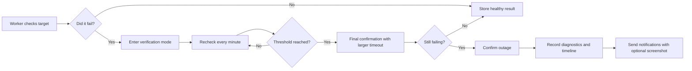

# Sentrovia

<p align="center">
  
</p>

<p align="center">
  <strong>Verification-aware monitoring for internal teams.</strong><br>
  Fewer false alarms, clearer evidence, and a clean operations console.
</p>

<p align="center">
  
  
  
  
  
</p>

## What Is Sentrovia?

Sentrovia is a self-hosted monitoring platform for websites, APIs, TCP ports, PostgreSQL endpoints, ping targets, JSON assertions, keyword checks, and heartbeat jobs.

It is built for teams that do not want an alert every time a single request times out. Sentrovia verifies failures first, records evidence, then sends notifications when an outage is confirmed.

**Good fit for:**

- Internal IT and operations teams
- Windows-heavy environments
- Teams that need PostgreSQL-backed worker state
- Operators who want alert history, delivery visibility, and HTML reports

## Highlights

| Area | What Sentrovia Does |
| --- | --- |
| Verified alerts | Rechecks failures before sending down notifications |
| Monitor types | HTTP, keyword, JSON, TCP, PostgreSQL, ping, heartbeat |
| Evidence | Captures Chromium screenshots for confirmed HTTP-style outages |
| Notifications | Email, Telegram, Discord, and generic webhooks |
| Reports | Scheduled and manual HTML reports |
| Status pages | Public pages for service health |
| Members | First admin onboarding, then admin-managed members |
| Windows services | Guided NSSM installation and one-click updates |

## Screenshots

### Dashboard and Monitoring

<table>
  <tr>
    <td width="50%">
      
    </td>
    <td width="50%">
      
    </td>
  </tr>
  <tr>
    <td><sub>Workspace health, worker state, recent activity, and system visibility.</sub></td>
    <td><sub>Monitor inventory, verification state, bulk actions, history strips, and company assignment.</sub></td>
  </tr>
</table>

### Delivery and Help

<table>
  <tr>
    <td width="50%">
      
    </td>
    <td width="50%">
      
    </td>
  </tr>
  <tr>
    <td><sub>Delivery testing, immutable history, retry visibility, and channel diagnostics.</sub></td>
    <td><sub>Built-in operational documentation for checks, workers, reports, notifications, and troubleshooting.</sub></td>
  </tr>
</table>

<p align="center">
  
</p>

## Choose Your Installation

| Deployment | Best for | First command |
| --- | --- | --- |
| Docker Compose | Recommended for most installations | `scripts/install-docker.ps1` or `scripts/install-docker.sh` |
| Windows + NSSM | Windows servers running without Docker | `scripts/install-windows-nssm.ps1` |

Both installers preserve existing environment files. They never rotate database passwords or encryption keys automatically.

## Install With Docker

Windows PowerShell:

```powershell
Set-ExecutionPolicy -Scope Process Bypass
.\scripts\install-docker.ps1
```

Linux or macOS:

```bash
chmod +x scripts/install-docker.sh
./scripts/install-docker.sh
```

The installer creates `.env` with strong random secrets and starts PostgreSQL, the web console, and the worker. Open [http://localhost:3000](http://localhost:3000) and follow onboarding to create the first administrator.

Normal start and stop commands:

```bash
docker compose up -d
docker compose down
```

Do not add `-v` to `docker compose down` on a real installation. It deletes the PostgreSQL volume.

<details>
<summary>Production Docker preparation</summary>

Prepare secrets without starting the local stack:

```powershell
.\scripts\install-docker.ps1 -SkipStart
```

On Linux or macOS, use `./scripts/install-docker.sh --prepare-only`. Set the public HTTPS `APP_URL` in `.env`, then start the strict production profile:

```bash
docker compose -f docker-compose.yml -f docker-compose.prod.yml up -d --build
```

</details>

## Install On Windows With NSSM

Requirements: Node.js 20.9+, npm, NSSM in `PATH`, and a PostgreSQL database with schema-change permissions. Run the installer from an Administrator PowerShell window:

```powershell
Set-ExecutionPolicy -Scope Process Bypass
.\scripts\install-windows-nssm.ps1
```

The installer creates `.env.local` when needed, applies migrations, builds the app, and creates `sentrovia-web` and `sentrovia-worker`. For an existing installation it preserves `.env.local` and database records.

<details>
<summary>Remote PostgreSQL parameters</summary>

```powershell
$DbPassword = Read-Host "PostgreSQL password" -AsSecureString
.\scripts\install-windows-nssm.ps1 `
  -AppUrl "https://monitoring.example.com" `
  -DatabaseHost "db.example.com" `
  -DatabaseUser "sentrovia" `
  -DatabaseName "sentrovia" `
  -DatabasePassword $DbPassword
```

</details>

## Configuration Safety

- `.env` and `.env.local` are private runtime files and are ignored by Git.
- `.env.example` is documentation only; never use its placeholder secrets in production.
- Back up PostgreSQL before production updates.
- Never replace `APP_ENCRYPTION_SECRET` on a live database without a credential-rotation plan. Stored SMTP, webhook, and monitor credentials depend on it.
- Set `AUTH_TRUST_PROXY_HEADERS=true` only behind a trusted proxy that sanitizes forwarded headers.

## Local Development

Run PostgreSQL in Docker and the app on your machine:

```bash
docker compose up -d db
npm install
npm run db:push
npm run db:manual
npm run dev
```

Start the worker in a second terminal:

```bash
npm run worker:dev
```

Useful commands:

```bash
npm run dev
npm run build
npm run start
npm run worker:dev
npm run worker:start
npm run lint
npm run test
npm run db:push
npm run db:manual
```

Manual migrations live in `drizzle/*_manual.sql`. In normal use, run one command:

```bash
npm run db:manual
```

The command records applied files in `public.sentrovia_manual_migrations`, skips files with the same checksum on later
runs, and stops if an already applied file was edited. Docker users usually do not run this manually because the web
container runs it during startup.

Advanced recovery option: if you know a production database already has all current manual SQL applied and you only want
to create the migration ledger without executing those files, run:

```bash
npm run db:manual:baseline
```

## Updating Sentrovia

Sentrovia shows new GitHub Releases under **Settings -> Updates**. Back up PostgreSQL before updating production.

### Docker

```bash
git fetch --tags origin
git checkout vX.Y.Z
docker compose up -d --build
```

For the strict production profile, use:

```bash
docker compose -f docker-compose.yml -f docker-compose.prod.yml up -d --build
```

Docker preserves `.env` and the PostgreSQL volume. The web container applies pending schema and manual migrations during startup.

### Windows + NSSM

```bat
git fetch --tags origin
git checkout vX.Y.Z
UPDATE-SENTROVIA.bat
```

If you copy release files to the server manually, skip the Git commands and double-click `UPDATE-SENTROVIA.bat` in the project root.

The updater requests Administrator permission and handles dependencies, migrations, build, and both service restarts. It preserves `.env.local` and database records. Errors stay visible and the full transcript is saved under `logs`.

<details>
<summary>Manual Node.js services without NSSM</summary>

```bat
npm ci
npm run db:push:bootstrap
npm run db:manual
npm run build
```

</details>

## How Failure Verification Works

Sentrovia avoids noisy first-failure alerts.



That means down alerts are tied to confirmed state transitions, not one unlucky timeout.

## Timeout and Slow Response Rules

Sentrovia separates availability failures from degraded latency:

- `2xx` and `3xx` responses are healthy by default.
- `4xx`, `5xx`, DNS, TLS, connection, assertion, and timeout errors are failures.
- A timeout enters verification first; Sentrovia sends an outage notification only after the configured retry threshold confirms it.
- A response that finishes after the slow-response threshold stays `up`, appears degraded on status pages, and sends a latency notification only after repeated slow checks.
- HTTP monitors can define custom expected status codes, such as `200, 204, 401`, when a non-standard response is still healthy.

## Monitoring

Sentrovia supports:

- HTTP and HTTPS checks
- Keyword assertions
- JSON path assertions
- TCP port reachability
- PostgreSQL connectivity
- ICMP ping checks
- Cron and heartbeat monitoring

Each monitor can define its own interval, timeout, retry behavior, HTTP method, redirect behavior, SSL behavior, cache behavior, response-size limit, active state, and slow-response threshold.

## Notifications and Evidence

Notification channels:

- SMTP email
- Telegram
- Discord webhook
- Generic webhook

Evidence features:

- Screenshot capture after confirmed HTTP, keyword, and JSON outages
- Delivery history with status, attempt count, response code, payload summary, and error details
- Recovery, status-change, latency, and prolonged-downtime templates
- Workspace-level templates with monitor-level overrides

Screenshots are best effort. Alerts still send if Chromium cannot capture a page.

For non-Docker production servers:

```bat
set PLAYWRIGHT_BROWSERS_PATH=0
npx playwright install chromium
```

## Reports

Reports are designed for people who need a readable operational summary, not a spreadsheet dump.

Sentrovia currently sends HTML reports only:

- Weekly, monthly, and all-time scopes
- Workspace-wide or company-scoped reports
- Manual preview and scheduled delivery
- URL-first tables, readable failure details, and service snapshots
- No CSV or PDF attachments

## Tech Stack

- Next.js 16
- React 19
- TypeScript
- PostgreSQL
- Drizzle ORM
- Zod
- Zustand
- Nodemailer
- Telegram Bot API
- Playwright Chromium
- Vitest
- Docker Compose
- NSSM

## Project Status

Sentrovia is usable today as an internal monitoring and operations console.

The strongest use case is an internal team that wants verified alerts, screenshot evidence, report delivery, and a Windows-friendly deployment model.

Possible next improvements:

- Signed release builds
- Demo video or GIF
- Hosted demo instance
- Role-based access controls
- Escalation policies
- Multi-region workers
- DNS-specific monitors

## License

MIT
