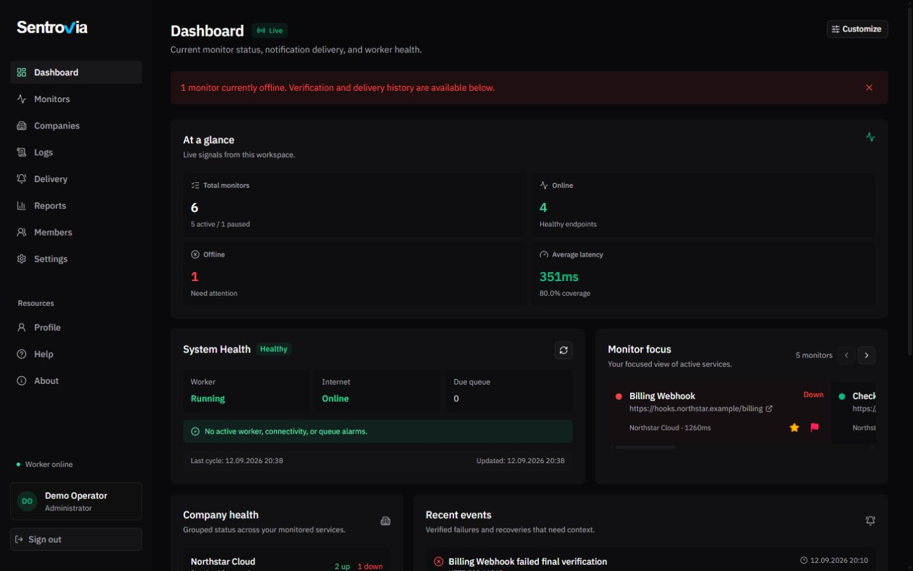
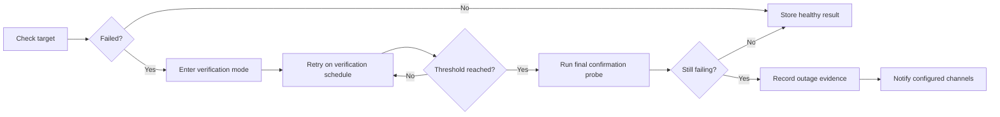
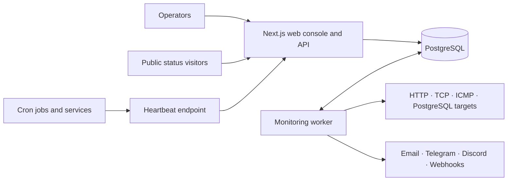

<h1 align="center">
  
</h1>

<p align="center">
  <strong>Self-hosted uptime monitoring that verifies failures before alerting.</strong><br>
  Monitor websites, APIs, TCP ports, PostgreSQL databases, ping targets, and cron or heartbeat jobs from one evidence-first operations workspace.
</p>

<p align="center">
  <a href="https://github.com/febroine/sentrovia-monitoring/actions/workflows/ci.yml"></a>
  <a href="https://github.com/febroine/sentrovia-monitoring/releases"></a>
  <a href="LICENSE"></a>
</p>

<p align="center">
  <a href="#quick-start">Quick Start</a> ·
  <a href="#features">Features</a> ·
  <a href="#how-outage-verification-works">Verification</a> ·
  <a href="#product-tour">Product Tour</a> ·
  <a href="docs/README.md">Documentation</a> ·
  <a href="CONTRIBUTING.md">Contributing</a>
</p>

<p align="center">
  <a href="docs/screenshots/demo-frames/01-dashboard.png">
    
  </a>
</p>

<p align="center"><sub>Real Sentrovia UI populated with isolated synthetic demo data.</sub></p>

## Overview

Sentrovia is an open-source, self-hosted uptime monitoring platform for small teams and operators who want trustworthy outage alerts without sending operational data to a hosted monitoring vendor. It combines service checks, failure verification, screenshot evidence, notification delivery history, reliability reports, and public status pages in one workspace.

The core premise is simple: **a failed request is evidence to verify, not immediately an outage to announce.** Sentrovia checks again, confirms that the monitoring host still has internet access, and performs a final probe before recording an outage and notifying the team.

## Why Sentrovia Exists

Transient DNS failures, short network interruptions, and connectivity loss on the monitoring server can all look like a service outage. Sentrovia is built to reduce those false alarms while leaving an inspectable trail when a failure is real.

- **Verify before escalating:** retry thresholds, verification scheduling, connectivity canaries, and a final confirmation probe protect against one-off failures.
- **Keep evidence with the event:** supported HTTP-style checks can capture screenshots, diagnostics, timelines, response details, and the root-cause summary.
- **Audit notification delivery:** email, Telegram, Discord, and generic webhook attempts have bounded retries and visible outcomes.
- **Own the deployment and data:** run the complete stack with Docker Compose or as native services on Windows Server.

## Features

- **Monitoring:** HTTP/HTTPS, API and JSON assertions, keyword checks, TCP ports, ICMP ping, PostgreSQL, and cron/heartbeat monitors.
- **Outage verification:** failure thresholds, scheduled verification probes, a final confirmation probe, and monitoring-host connectivity checks.
- **Evidence:** check history, timelines, latency and response details, diagnostics, and best-effort screenshots for confirmed HTTP-style failures.
- **Alerts:** SMTP email, Telegram, Discord webhooks, generic webhooks, slow-response warnings, recovery notices, downtime reminders, and TLS-expiry notices.
- **Notification content:** workspace and per-monitor templates, English or Turkish notification content, editable branding, and light/dark email previews.
- **Operations:** live dashboard, monitor and company views, delivery history, dead-letter visibility, manual resend, logs, and temporary monitor pauses.
- **Status and reporting:** public status pages, uptime and latency analytics, scheduled reports, HTML export, and company-scoped reporting.
- **Administration:** administrator/member roles, workspace isolation, monitor import/export, Prometheus metrics, and encrypted PostgreSQL backups.

Sentrovia measures service reachability and response health. It is not a replacement for host-level CPU, memory, disk, log, or network-traffic observability.

## Quick Start

### Requirements

- Git
- Docker Engine with Docker Compose

The installer generates private application and database secrets, starts PostgreSQL, applies the schema, and launches the web console and monitoring worker.

Linux or macOS:

```bash
git clone https://github.com/febroine/sentrovia-monitoring.git
cd sentrovia-monitoring
chmod +x scripts/install-docker.sh
./scripts/install-docker.sh
```

Windows PowerShell:

```powershell
git clone https://github.com/febroine/sentrovia-monitoring.git
cd sentrovia-monitoring
Set-ExecutionPolicy -Scope Process Bypass
.\scripts\install-docker.ps1
```

Open [http://localhost:3000](http://localhost:3000), create the first administrator account, and add your first monitor.

For HTTPS, reverse-proxy settings, production Compose, native Windows services, updates, backups, and recovery, use the [deployment guide](docs/deployment.md).

## How Outage Verification Works


```mermaid
flowchart LR
    A["Check target"] --> B{"Failed?"}
    B -- "No" --> C["Store healthy result"]
    B -- "Yes" --> D["Enter verification mode"]
    D --> E["Retry on verification schedule"]
    E --> F{"Threshold reached?"}
    F -- "No" --> E
    F -- "Yes" --> G["Run final confirmation probe"]
    G --> H{"Still failing?"}
    H -- "No" --> C
    H -- "Yes" --> I["Record outage evidence"]
    I --> J["Notify configured channels"]
```

Before claiming monitor work, the worker also checks multiple independent public canaries. If every canary is unreachable, Sentrovia pauses checks and outbound delivery instead of marking healthy targets down. Processing resumes when connectivity returns.

## Product Tour

<p align="center">
  
</p>

<p align="center"><sub>Dashboard → monitors → delivery → reports → notification templates → public status page.</sub></p>

## Alerts and Evidence

Notification destinations resolve from monitor settings to company settings and then workspace defaults. Recipient-facing email actions open the monitored target through **Check site**; notification messages do not link recipients into the private Sentrovia panel.

For confirmed HTTP, keyword, and JSON failures, screenshot capture is best effort. An unavailable Chromium process never blocks the alert itself. Delivery tests use the real configured transport and appear in delivery history, but are excluded from channel health and delivery summary counters.

## Synthetic Demo Workspace

Sentrovia includes an opt-in seed for documentation, evaluation, and screenshots. It creates an isolated workspace with synthetic companies, monitors, thirty days of check history, outage events, delivery attempts, a report schedule, and a public status page. Reserved `.example` targets are used and scheduled checks are parked in the future.

Create a demo workspace with a unique identifier containing at least eight letters or numbers:

```bash
docker compose exec -e SENTROVIA_DEMO_RUN_ID=readme20260912 web node scripts/manage-demo-workspace.mjs create
```

The command prints temporary credentials and the public status page URL. Remove every record created for the identifier when finished:

```bash
docker compose exec -e SENTROVIA_DEMO_RUN_ID=readme20260912 web node scripts/manage-demo-workspace.mjs cleanup
```

The seed never runs during installation, startup, migration, or production updates.

## Deployment and Configuration

- **Docker Compose:** recommended for most installations. Follow the [Docker installation guide](docs/deployment.md#docker-compose).
- **Windows with NSSM:** runs Sentrovia as native Windows Server services without Docker. Follow the [Windows installation guide](docs/deployment.md#windows-services-with-nssm).

Tagged releases publish immutable source archives, SHA-256 checksums, build-provenance attestations, and versioned container images:

```bash
docker pull ghcr.io/febroine/sentrovia-monitoring:latest
```

Browse [GitHub Releases](https://github.com/febroine/sentrovia-monitoring/releases) for archives and checksums, or the [GitHub Container Registry package](https://github.com/febroine/sentrovia-monitoring/pkgs/container/sentrovia-monitoring) for published image tags.

Important configuration rules:

- Never commit `.env` or `.env.local`.
- Preserve `APP_ENCRYPTION_SECRET` with database backups; stored credentials and encrypted backups depend on it.
- Set a public HTTPS `APP_URL` in production.
- Enable proxy-header trust only behind a proxy that sanitizes forwarded headers.
- Set `MONITOR_ALLOW_PRIVATE_TARGETS=false` when the installation must not reach private networks.

See [deployment and configuration](docs/deployment.md) for the complete environment, update, backup, recovery, metrics, and release-verification guidance.

## Architecture


```mermaid
flowchart LR
    Operators["Operators"] --> Web["Next.js web console and API"]
    Visitors["Public status visitors"] --> Web
    Jobs["Cron jobs and services"] --> Heartbeat["Heartbeat endpoint"]
    Heartbeat --> Web
    Web --> DB[("PostgreSQL")]
    Worker["Monitoring worker"] --> Targets["HTTP · TCP · ICMP · PostgreSQL targets"]
    Worker --> Channels["Email · Telegram · Discord · Webhooks"]
    Worker <--> DB
```

The web service owns the interface, authenticated API, public status pages, and heartbeat intake. The worker claims due checks, verifies failures, stores results, and processes notification and report delivery. PostgreSQL is the shared durable state.

## Local Development

Requirements: Node.js 20.9 or newer, npm, PostgreSQL 16, and Playwright Chromium for screenshot tests.

Configure a private `.env.local` with strong local-only secrets and either `DATABASE_URL` or the `POSTGRES_*` values from [.env.example](.env.example). Then run:

```bash
npm ci
npm run db:sync
npm run dev
```

Start the worker in another terminal:

```bash
npm run worker:dev
```

Run the same checks as CI:

```bash
npx playwright install chromium
npm test
npm run lint
npm run typecheck
npm run benchmark:scale
npm run build
```

The dynamic browser suite covers authenticated routes, API boundaries, critical UI interactions, responsive overflow, reports, status pages, and notification previews. See the [dynamic E2E test cases](docs/dynamic-e2e-test-cases.md).

## Documentation

- [Documentation index](docs/README.md)
- [Deployment, configuration, updates, and recovery](docs/deployment.md)
- [Scale benchmark methodology](docs/scale-benchmarks.md)
- [Dynamic end-to-end test cases](docs/dynamic-e2e-test-cases.md)
- [Changelog](CHANGELOG.md)
- [Contributing guide](CONTRIBUTING.md)
- [Security policy](SECURITY.md)

## Roadmap

Sentrovia is usable today as an internal website and API uptime monitoring console. Planned areas include multi-region workers, DNS-specific monitors, and a hosted read-only demo. These are roadmap items, not current features.

Feature proposals are welcome through the [issue tracker](https://github.com/febroine/sentrovia-monitoring/issues), but large changes should be discussed before implementation.

## Contributing

Focused bug fixes, tests, documentation improvements, and well-scoped product changes are welcome. Read [CONTRIBUTING.md](CONTRIBUTING.md) for the development setup, validation commands, and pull-request expectations.

## Security

Report suspected vulnerabilities privately through the process in [SECURITY.md](SECURITY.md). Do not include credentials, private monitor targets, customer data, or database contents in a public issue.

## License

Sentrovia is open source under the [MIT License](LICENSE).
