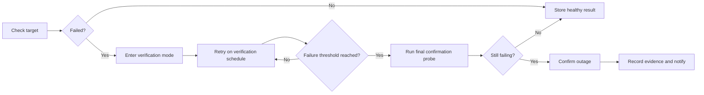

# Sentrovia — Open-Source, Self-Hosted Website Uptime Monitoring

<p align="center">
  <strong>Verify outages before they become alerts.</strong><br>
  Sentrovia is an open-source, self-hosted website uptime monitoring platform for websites, APIs, servers, PostgreSQL databases, ports, cron jobs, and heartbeat endpoints. It combines verified outage alerts, screenshot evidence, public status pages, incident coordination, and auditable notification delivery in one operations workspace.
</p>

<p align="center">
  <a href="https://github.com/febroine/sentrovia-monitoring/actions/workflows/ci.yml"></a>
  <a href="https://github.com/febroine/sentrovia-monitoring/releases"></a>
  <a href="https://github.com/febroine/sentrovia-monitoring/blob/main/LICENSE"></a>
  
  
</p>

<p align="center">
  <a href="#quick-start">Quick start</a> ·
  <a href="#supported-uptime-checks">Checks</a> ·
  <a href="#how-verified-outage-alerts-work">Verification</a> ·
  <a href="#screenshots">Screenshots</a> ·
  <a href="docs/deployment.md">Deployment guide</a> ·
  <a href="SECURITY.md">Security</a>
</p>

<p align="center">
  
</p>

<p align="center"><sub>Product walkthrough with synthetic example data.</sub></p>

## Why Sentrovia?

Most uptime monitoring tools treat a single failed request as an outage. Sentrovia verifies failures first, checks whether the monitoring server itself has lost internet access, and records evidence before notifying your team.

- **Fewer false alarms:** retries, verification mode, and a final confirmation probe protect against transient failures.
- **Evidence you can inspect:** HTTP-style outages can include screenshots, diagnostics, timelines, and response details.
- **Delivery you can audit:** email, Telegram, Discord, and generic webhooks have bounded retries and visible outcomes.
- **Operations in context:** acknowledge incidents, assign owners, escalate, publish updates, and schedule maintenance windows.
- **Data ownership:** run the complete stack on your infrastructure with Docker Compose or native Windows services.
- **Workspace isolation:** role-based access protects monitors, status pages, reports, delivery history, and settings.

Sentrovia is designed for teams that want a practical uptime monitor and status page without giving monitoring data or operational credentials to a hosted vendor.

## Supported Uptime Checks

| Monitor | What Sentrovia verifies |
| --- | --- |
| HTTP / HTTPS | Availability, response status, latency, redirects, and TLS behavior |
| API and JSON | HTTP synthetic monitoring with JSON path and expected-value assertions |
| Keyword | Required or forbidden response content |
| TCP port | Reachability for services such as SSH, SMTP, and custom applications |
| ICMP ping | Host and server uptime reachability |
| PostgreSQL | Database connectivity with configurable TLS verification |
| Heartbeat / cron | Scheduled jobs and services that report their own liveness |

Each monitor can define its interval, timeout, retry threshold, expected status codes, HTTP method, redirects, SSL behavior, response-size limit, tags, notification routing, and slow-response threshold.

Use ICMP ping and TCP checks to monitor server uptime without installing an agent. Sentrovia measures service reachability and response health; it does not claim to replace CPU, memory, disk, or network-traffic observability.

## How Verified Outage Alerts Work


```mermaid
flowchart LR
    A["Check target"] --> B{"Failed?"}
    B -- "No" --> C["Store healthy result"]
    B -- "Yes" --> D["Enter verification mode"]
    D --> E["Retry on verification schedule"]
    E --> F{"Failure threshold reached?"}
    F -- "No" --> E
    F -- "Yes" --> G["Run final confirmation probe"]
    G --> H{"Still failing?"}
    H -- "No" --> C
    H -- "Yes" --> I["Confirm outage"]
    I --> J["Record evidence and notify"]
```

Before claiming monitor work, the worker also checks multiple independent public canaries. If every canary is unreachable, Sentrovia pauses checks and outbound delivery without marking healthy services down. Processing resumes automatically when connectivity returns.

## Quick Start

The installer creates a private environment file, generates strong secrets, starts PostgreSQL, applies the database schema, and launches the web console and monitoring worker.

Linux or macOS:

```bash
git clone https://github.com/febroine/sentrovia-monitoring.git
cd sentrovia-monitoring
chmod +x scripts/install-docker.sh
./scripts/install-docker.sh
```

Windows PowerShell:

```powershell
git clone https://github.com/febroine/sentrovia-monitoring.git
cd sentrovia-monitoring
Set-ExecutionPolicy -Scope Process Bypass
.\scripts\install-docker.ps1
```

Open [http://localhost:3000](http://localhost:3000) and create the first administrator account. Existing installations can restart normally with:

```bash
docker compose up -d --build
```

For production Docker settings, native Windows installation with NSSM, safe updates, restore procedures, and environment rules, read the [deployment guide](docs/deployment.md).

## Public Status Pages and Incident Management

Publish a self-hosted status page for the whole workspace or separate public status pages for individual companies. Each page has its own slug, title, summary, publish state, service history, and public incident timeline.

When an outage is open, operators can:

- acknowledge it and assign a workspace member;
- set an escalation level;
- add internal notes or publish selected updates;
- silence notifications for one monitor or the whole workspace;
- continue collecting checks and evidence during maintenance.

Private notes, assignees, and escalation details never appear on public status pages.

## Alerts, Evidence, and Reports

Sentrovia routes notifications from monitor-specific settings to company settings and then workspace defaults. Supported channels are SMTP email, Telegram, Discord webhook, and generic webhook.

- Screenshot evidence after confirmed HTTP, keyword, and JSON failures with stable responses
- Delivery history with attempts, response codes, payload summaries, and errors
- Bounded retry queues, dead-letter visibility, and manual resend
- Down, recovery, status-change, latency, and prolonged-downtime templates
- Weekly, monthly, and custom-range HTML reports
- Workspace-wide or company-scoped reporting and scheduled delivery

Screenshots are best effort, so an unavailable Chromium process never blocks an alert.

## Screenshots

<table>
  <tr>
    <td width="50%"></td>
    <td width="50%"></td>
  </tr>
  <tr>
    <td><sub>Workspace health, worker state, activation progress, and operational visibility.</sub></td>
    <td><sub>Server-paginated monitors, bulk actions, incident coordination, and timelines.</sub></td>
  </tr>
  <tr>
    <td width="50%"></td>
    <td width="50%"></td>
  </tr>
  <tr>
    <td><sub>Channel testing, retries, delivery health, and controlled history cleanup.</sub></td>
    <td><sub>Built-in guidance for checks, alerts, reports, workers, and troubleshooting.</sub></td>
  </tr>
</table>

## Deployment Options

| Deployment | Best for | Guide |
| --- | --- | --- |
| Docker Compose | Recommended for most self-hosted uptime monitoring installations | [Docker installation](docs/deployment.md#docker-compose) |
| Windows + NSSM | Windows servers running without Docker | [Windows installation](docs/deployment.md#windows-services-with-nssm) |

Every release also publishes a container image:

```bash
docker pull ghcr.io/febroine/sentrovia-monitoring:latest
```

Never commit `.env` or `.env.local`. Preserve `APP_ENCRYPTION_SECRET` with database backups because stored credentials and encrypted backups depend on it.

## Local Development

Requirements: Node.js 20.9+, npm, Docker, and PostgreSQL.

```bash
docker compose up -d db
npm install
npm run db:sync
npm run dev
```

Start the worker in another terminal:

```bash
npm run worker:dev
```

Validate a change with:

```bash
npm run typecheck
npm run lint
npm test
npm run build
```

The isolated dynamic test suite covers authenticated routes, API boundaries, core UI interactions, responsive overflow, reports, status pages, and notification previews. See [dynamic E2E test cases](docs/dynamic-e2e-test-cases.md).

## Documentation

- [Deployment, configuration, updates, and recovery](docs/deployment.md)
- [Scale benchmark and capacity testing](docs/scale-benchmarks.md)
- [Dynamic end-to-end test cases](docs/dynamic-e2e-test-cases.md)
- [Contributing](CONTRIBUTING.md)
- [Security policy](SECURITY.md)

## Tech Stack

Next.js 16, React 19, TypeScript, PostgreSQL, Drizzle ORM, Zod, Zustand, Nodemailer, Playwright Chromium, Vitest, Docker Compose, and NSSM.

## Project Status

Sentrovia is usable today as an internal website and API uptime monitoring console. Its strongest fit is a team that needs verified alerts, screenshot evidence, PostgreSQL monitoring, incident coordination, report delivery, and Windows-friendly deployment.

Planned areas include multi-region workers, DNS-specific monitors, escalation policies, and a hosted read-only demo. These are not presented as current features.

## Contributing and Security

Focused bug fixes, tests, and documentation improvements are welcome. Read [CONTRIBUTING.md](CONTRIBUTING.md) before opening a pull request.

Report suspected vulnerabilities privately through [SECURITY.md](SECURITY.md). Never include credentials, private monitor targets, customer data, or database contents in a public issue.

## License

Sentrovia is open source under the [MIT License](LICENSE).
