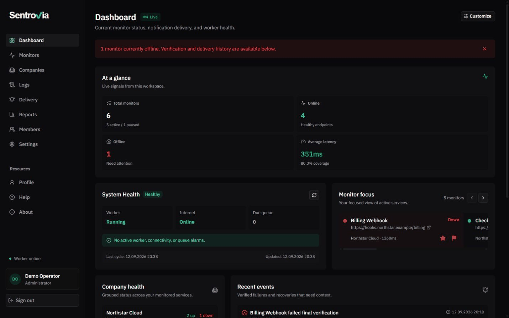
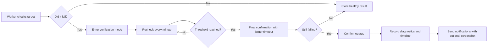
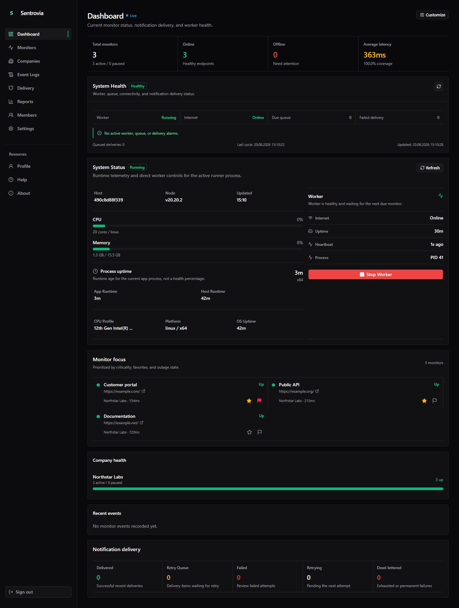
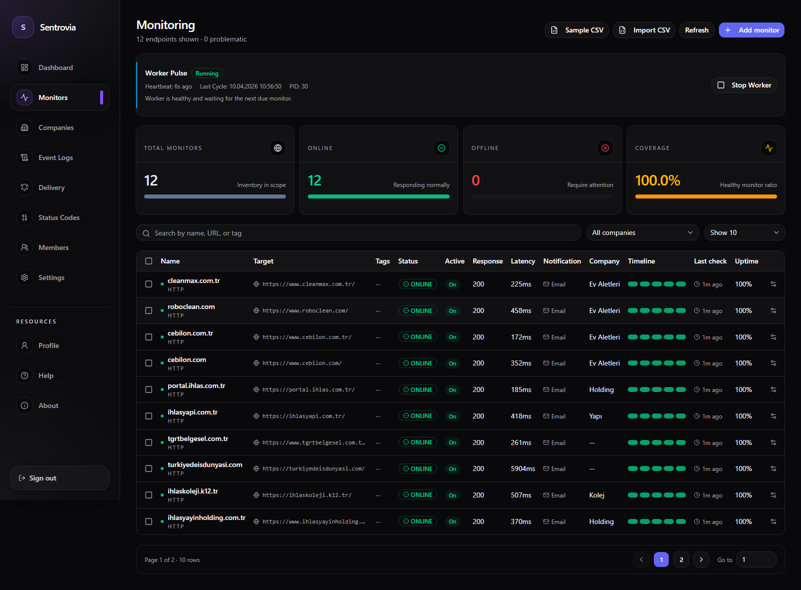
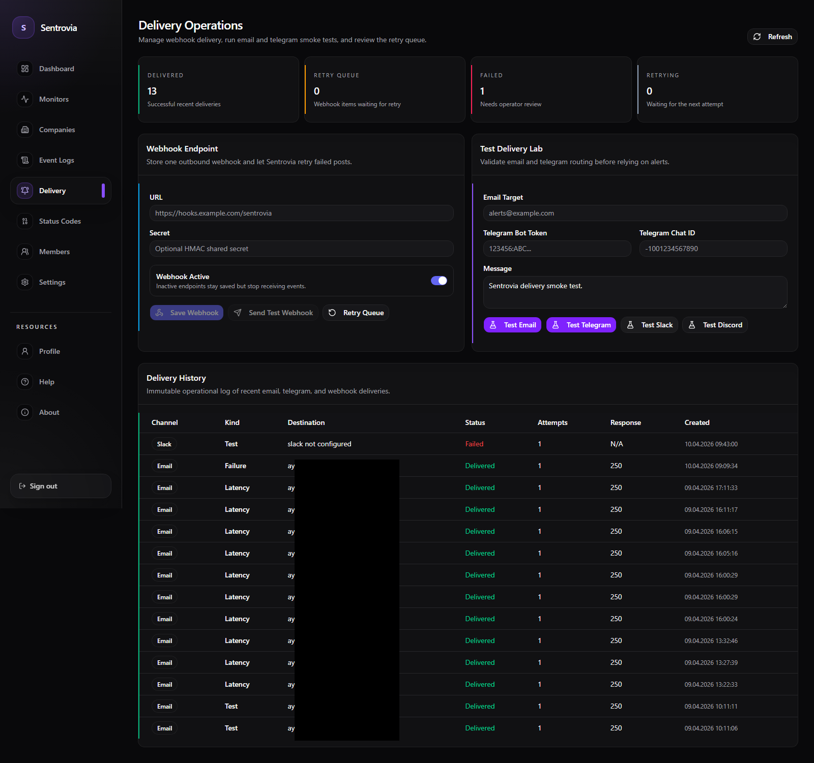
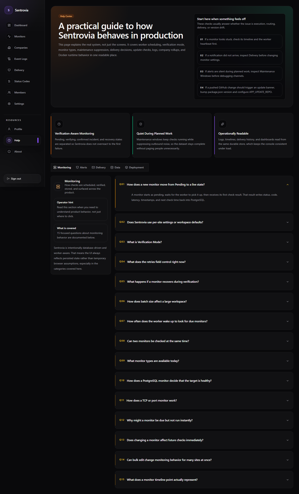
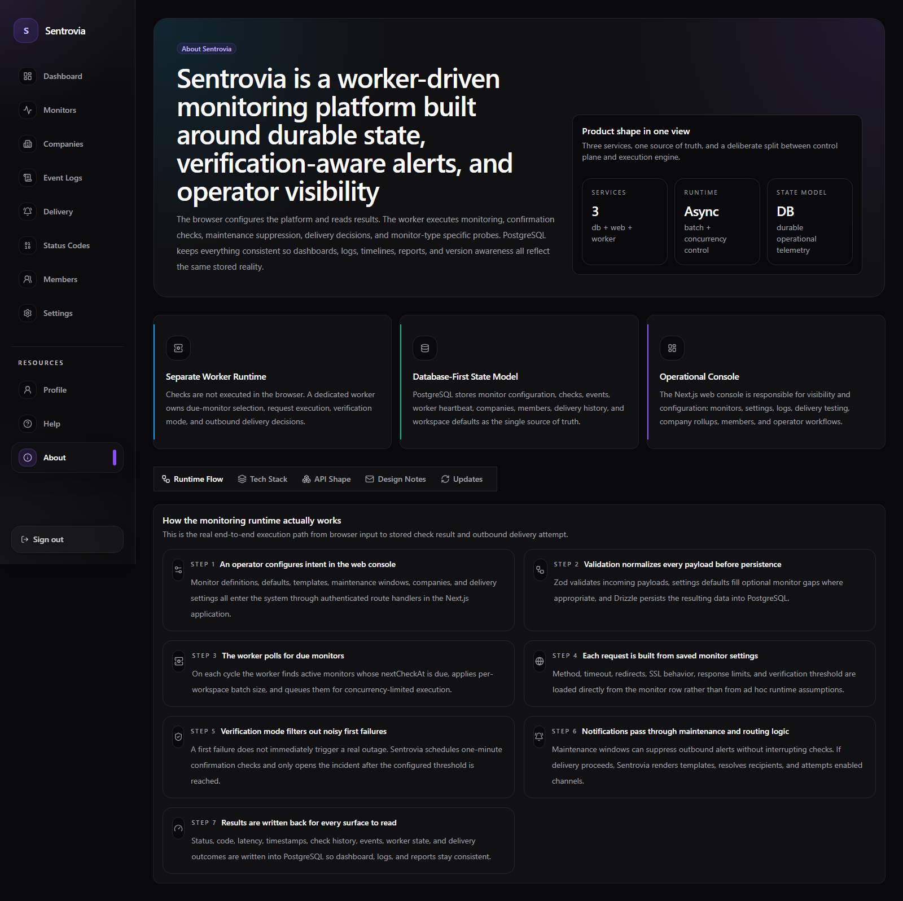

# SENTROVIA

<p align="center">
  <strong>Self-hosted uptime monitoring that verifies outages before alerting you.</strong><br>
  HTTP, TCP, Ping, PostgreSQL, JSON, keyword, and heartbeat checks with screenshot evidence, reliable alert delivery, and Windows-friendly deployment.
</p>

<p align="center">
  <a href="https://github.com/febroine/sentrovia-monitoring/actions/workflows/ci.yml"></a>
  <a href="https://github.com/febroine/sentrovia-monitoring/releases"></a>
  <a href="https://github.com/febroine/sentrovia-monitoring/blob/main/LICENSE"></a>
  
  
</p>

<p align="center">
  <a href="docs/screenshots/demo.gif">Product walkthrough</a> ·
  <a href="#quick-start">Quick start</a> ·
  <a href="#how-failure-verification-works">Verification flow</a> ·
  <a href="SECURITY.md">Security</a>
</p>

<p align="center">
  
</p>

<p align="center"><sub>A short product walkthrough using synthetic example data. Monitor services, confirm failures, and understand what happened from one focused workspace.</sub></p>

## Why Sentrovia?

- [x] Confirms failures before sending DOWN alerts
- [x] Detects when the monitoring server itself loses internet access
- [x] Captures evidence after confirmed HTTP-style failures
- [x] Keeps delivery retries and notification outcomes auditable
- [x] Isolates monitor, delivery, report, status-page, and settings data by workspace and role
- [x] Coordinates incidents with acknowledgement, ownership, escalation, and public updates
- [x] Silences notifications during auditable maintenance windows without stopping checks
- [x] Monitors HTTP, TCP, Ping, PostgreSQL, JSON, keyword, and heartbeat targets
- [x] Runs with Docker Compose or as native Windows services through NSSM

## How Failure Verification Works

Sentrovia avoids turning one unlucky timeout into an incident.


```mermaid
flowchart LR
    A["Worker checks target"] --> B{"Did it fail?"}
    B -- "No" --> C["Store healthy result"]
    B -- "Yes" --> D["Enter verification mode"]
    D --> E["Recheck every minute"]
    E --> F{"Threshold reached?"}
    F -- "No" --> E
    F -- "Yes" --> G["Final confirmation with larger timeout"]
    G --> H{"Still failing?"}
    H -- "No" --> C
    H -- "Yes" --> I["Confirm outage"]
    I --> J["Record diagnostics and timeline"]
    J --> K["Send notifications with optional screenshot"]
```

Down alerts are tied to confirmed state transitions, not a single failed request.

### Internet outage guard

Before claiming monitor work, the worker checks several independent public canaries. If every canary is unreachable, Sentrovia pauses monitor checks, webhook retries, and scheduled report delivery without changing monitor states or sending outage notifications. Work resumes automatically after any canary responds.

The defaults avoid treating one blocked provider as a server-wide outage. Restricted networks can set `WORKER_CONNECTIVITY_TARGETS` to a comma-separated list of at least two reliable HTTP or HTTPS endpoints available from the worker host. The guard can be tuned with `WORKER_CONNECTIVITY_TIMEOUT_MS`; disabling it with `WORKER_CONNECTIVITY_CHECK_ENABLED=false` removes this false-positive protection.

## Quick Start

The installer creates the private environment file, generates strong secrets, starts PostgreSQL, applies the database schema, and launches Sentrovia.

Linux or macOS:

```bash
git clone https://github.com/febroine/sentrovia-monitoring.git
cd sentrovia-monitoring
chmod +x scripts/install-docker.sh
./scripts/install-docker.sh
```

Windows PowerShell:

```powershell
git clone https://github.com/febroine/sentrovia-monitoring.git
cd sentrovia-monitoring
Set-ExecutionPolicy -Scope Process Bypass
.\scripts\install-docker.ps1
```

Open [http://localhost:3000](http://localhost:3000) and complete the first administrator onboarding. For an installation that already has a private `.env`, the normal restart command is:

```bash
docker compose up -d --build
```

Never commit `.env` or `.env.local`; they contain deployment secrets. The detailed migration, security, update, and Windows service documentation is below.

If an existing installation has accounts but no administrator, do not reopen onboarding. Promote one existing account from the server instead:

```bash
npm run auth:recover-admin -- --identifier admin@example.com
```

For Docker deployments, run the same protected command inside the web container:

```bash
docker compose exec web npm run auth:recover-admin -- --identifier admin@example.com
```

Recovery refuses to run while any admin exists, never creates an account, and closes the recovered account's existing sessions.

Every version tag also publishes an image to GitHub Container Registry:

```bash
docker pull ghcr.io/febroine/sentrovia-monitoring:latest
```

Versioned images are published as `:<major>.<minor>` and `:<major>.<minor>.<patch>` alongside `:latest`. Every image requires the same runtime environment and PostgreSQL configuration described below.

## Screenshots

### Dashboard and Monitoring

<table>
  <tr>
    <td width="50%">
      
    </td>
    <td width="50%">
      
    </td>
  </tr>
  <tr>
    <td><sub>Workspace health, activation progress, worker state, recent activity, and system visibility.</sub></td>
    <td><sub>Server-paginated monitor inventory, incident coordination, maintenance windows, bulk actions, and lazy-loaded timelines.</sub></td>
  </tr>
</table>

### Delivery and Help

<table>
  <tr>
    <td width="50%">
      
    </td>
    <td width="50%">
      
    </td>
  </tr>
  <tr>
    <td><sub>Delivery testing, paginated history, controlled cleanup, retry visibility, and channel diagnostics.</sub></td>
    <td><sub>Built-in operational documentation for checks, workers, reports, notifications, and troubleshooting.</sub></td>
  </tr>
</table>

<p align="center">
  
</p>

## Choose Your Installation

| Deployment | Best for | First command |
| --- | --- | --- |
| Docker Compose | Recommended for most installations | `scripts/install-docker.ps1` or `scripts/install-docker.sh` |
| Windows + NSSM | Windows servers running without Docker | `scripts/install-windows-nssm.ps1` |

Both installers preserve existing environment files. They never rotate database passwords or encryption keys automatically.
For a new installation, do not create an environment file by hand: the selected installer creates the correct private file and strong secrets.

## Install With Docker

Windows PowerShell:

```powershell
Set-ExecutionPolicy -Scope Process Bypass
.\scripts\install-docker.ps1
```

Linux or macOS:

```bash
chmod +x scripts/install-docker.sh
./scripts/install-docker.sh
```

The installer creates `.env` with strong random secrets and starts PostgreSQL, the web console, and the worker. Open [http://localhost:3000](http://localhost:3000) and follow onboarding to create the first administrator. The Docker Compose file is intentionally strict: running `docker compose up` without the generated `.env` stops before PostgreSQL is initialized with a password you cannot recover.
If a PostgreSQL volume already exists but `.env` is missing, the installer stops instead of generating a mismatched database password. Restore the original `.env` from backup.

Normal start and stop commands:

```bash
docker compose up -d
docker compose down
```

Do not add `-v` to `docker compose down` on a real installation. It deletes the PostgreSQL volume.

<details>
<summary>Production Docker preparation</summary>

Prepare secrets without starting the local stack:

```powershell
.\scripts\install-docker.ps1 -SkipStart
```

On Linux or macOS, use `./scripts/install-docker.sh --prepare-only`. Set the public HTTPS `APP_URL` in `.env`, then start the strict production profile:

```bash
docker compose -f docker-compose.yml -f docker-compose.prod.yml up -d --build --wait --wait-timeout 300
```

</details>

## Install On Windows With NSSM

Requirements: Node.js 20.9+, npm, NSSM in `PATH`, and a PostgreSQL database with schema-change permissions. Run the installer from an Administrator PowerShell window:

```powershell
Set-ExecutionPolicy -Scope Process Bypass
.\scripts\install-windows-nssm.ps1
```

The installer creates `.env.local` when needed, prompts for the PostgreSQL connection, applies migrations, builds the app, and creates `sentrovia-web` and `sentrovia-worker`. For an existing installation it preserves `.env.local` and database records. It also recognizes the legacy `SentroviaWeb` and `SentroviaWorker` service names during updates.

<details>
<summary>Remote PostgreSQL parameters</summary>

```powershell
$DbPassword = Read-Host "PostgreSQL password" -AsSecureString
.\scripts\install-windows-nssm.ps1 `
  -AppUrl "https://monitoring.example.com" `
  -DatabaseHost "db.example.com" `
  -DatabaseUser "sentrovia" `
  -DatabaseName "sentrovia" `
  -DatabasePassword $DbPassword
```

</details>

## Configuration Safety

- `.env` and `.env.local` are private runtime files and are ignored by Git.
- `.env.example` is documentation only; never use its placeholder secrets in production.
- Docker uses `.env`; Windows NSSM uses `.env.local`. The application and service scripts load these files automatically.
- Back up PostgreSQL before production updates.
- Never replace `APP_ENCRYPTION_SECRET` on a live database without a credential-rotation plan. Stored SMTP, webhook, and monitor credentials depend on it.
- Set `AUTH_TRUST_PROXY_HEADERS=true` only behind a trusted proxy that sanitizes forwarded headers.

## Local Development

Run PostgreSQL in Docker and the app on your machine:

```bash
docker compose up -d db
npm install
npm run db:sync
npm run dev
```

Start the worker in a second terminal:

```bash
npm run worker:dev
```

Both direct worker commands load `.env.local` and `.env` with the same precedence as the web application, so runtime settings do not need to be exported manually in the shell.

Useful commands:

```bash
npm run dev
npm run build
npm run start
npm run worker:dev
npm run worker:start
npm run lint
npm run test
npm run test:e2e:dynamic
npm run db:sync
npm run db:push
npm run db:manual
npm run benchmark:scale
npm run backup:restore -- --help
```

`npm run test:e2e:dynamic` exercises the running Docker deployment with an isolated temporary administrator. It covers authenticated routes, core UI interactions, API boundaries, responsive overflow, reports, status pages, and notification previews, then removes the temporary test data even when a check fails.

Use the schema synchronizer during normal installations and updates:

```bash
npm run db:sync
```

It detects whether the database is empty or already initialized and safely orders the Drizzle schema push and manual SQL
migrations. Manual migrations live in `drizzle/*_manual.sql`; applied files are recorded in
`public.sentrovia_manual_migrations`, skipped on later runs, and rejected if an applied file's checksum changes. Docker
users usually do not run this manually because the web container runs it during startup. `db:push` and `db:manual` remain
available as lower-level maintenance commands.

Advanced recovery option: if you know a production database already has all current manual SQL applied and you only want
to create the migration ledger without executing those files, run:

```bash
npm run db:manual:baseline
```

## Updating Sentrovia

Sentrovia shows new GitHub Releases under **Settings -> Updates**. Back up PostgreSQL before updating production.

### Docker

```bash
git fetch --tags origin
git checkout vX.Y.Z
./scripts/install-docker.sh
```

On Windows PowerShell, use `.\scripts\install-docker.ps1` for the last command. The installer preserves database credentials and encryption secrets, rotates only the deployment session identifier, and then rebuilds the stack. Users sign in again after the update.

For the strict production profile, use:

```bash
docker compose -f docker-compose.yml -f docker-compose.prod.yml up -d --build --wait --wait-timeout 300
```

Docker preserves `.env` and the PostgreSQL volume. The web container applies pending schema and manual migrations during startup.

### Windows + NSSM

```bat
git fetch --tags origin
git checkout vX.Y.Z
UPDATE-SENTROVIA.bat
```

If you copy release files to the server manually, skip the Git commands and double-click `UPDATE-SENTROVIA.bat` in the project root.

The updater requests Administrator permission and handles dependencies, build validation, migrations, and both service restarts. It recognizes both `SentroviaWeb` / `SentroviaWorker` and newer hyphenated service names. It removes known retired project paths left behind by manually overlaid releases, while preserving `.env.local` and database records. Previous dependencies and the production build are restored if an update fails. Browser sessions from the previous deployment are invalidated, so users sign in again after a successful update. Errors stay visible and the full transcript is saved under `logs`.
When a release introduces new non-secret runtime settings, the updater appends only missing defaults to `.env.local`. Existing database credentials, authentication and encryption secrets, and application settings are never replaced; only the deployment session identifier is rotated to invalidate old browser sessions.

### Verify a downloaded release

Every release publishes a source archive, `SHA256SUMS`, and a GitHub build-provenance attestation. Verify both before copying an archive to a server:

```bash
sha256sum --check SHA256SUMS
gh attestation verify sentrovia-monitoring-vX.Y.Z.zip --repo febroine/sentrovia-monitoring
```

Published version tags and release assets are immutable. Use a new patch version for every corrected release instead of moving an existing tag.

<details>
<summary>Manual Node.js services without NSSM</summary>

```bat
npm ci
npm run build
npm run db:sync
```

</details>

## Timeout and Slow Response Rules

Sentrovia separates availability failures from degraded latency:

- `2xx` and `3xx` responses are healthy by default.
- `4xx`, `5xx`, DNS, TLS, connection, assertion, and timeout errors are failures.
- A timeout enters verification first; after the consecutive-failure threshold is reached, one final immediate probe must also fail before Sentrovia sends an outage notification.
- The configured HTTP timeout is a complete request budget: DNS resolution, redirects, connection, response, and assertion processing share it.
- Any failed probe is discarded before state or notification processing when the worker detects that its own internet connection is unavailable.
- Invalid monitor configuration and blocked monitor policy checks are recorded as pending configuration errors. They do not create outages or send down notifications.
- A response that finishes after the slow-response threshold stays `up`, appears degraded on status pages, and sends a latency notification only after repeated slow checks.
- HTTP monitors can define custom expected status codes, such as `200, 204, 401`, when a non-standard response is still healthy.

## Monitoring

Sentrovia supports:

- HTTP and HTTPS checks
- Keyword assertions
- JSON path assertions
- TCP port reachability
- PostgreSQL connectivity
- ICMP ping checks
- Cron and heartbeat monitoring

Each monitor can define its own interval, timeout, retry behavior, HTTP method, redirect behavior, SSL behavior, cache behavior, response-size limit, active state, and slow-response threshold.

## Workspace Access

Sentrovia uses four workspace roles:

- **Administrator:** all product, worker, private-target, member, and database-backup controls
- **Manager:** team and operational administration without infrastructure backup or private-target privileges
- **Operator:** monitor, company, delivery, report, and workspace configuration
- **Viewer:** read-only workspace access

The API enforces permissions independently of disabled or hidden interface controls. Role changes invalidate the affected member's existing sessions.

Operational data and shared configuration are scoped to the active workspace. Appearance, dashboard layout, time display, and notification-language preferences remain personal to each member. The server resolves the active workspace from the authenticated membership; API clients cannot select another workspace by submitting a `workspaceId`.

After first sign-in, administrators see an activation checklist derived from live system state: create a monitor, verify an online worker connection, and complete a successful delivery.

## Database Backups

Administrators can enable daily PostgreSQL backups under **Settings -> Data**. The worker creates a PostgreSQL custom-format dump, verifies it with `pg_restore`, encrypts it with AES-256-GCM using the application encryption secret, records a SHA-256 checksum, and rotates only verified backup files according to the configured retention count.

Docker stores automatic backups in the named `backups` volume. Native installations default to the `backups` directory; set `AUTOMATIC_BACKUP_DIRECTORY` to use a protected host path. A restore is verification-only unless destructive confirmation is explicit:

```bash
npm run backup:restore -- backups/sentrovia-db-YYYY-MM-DDTHHMMSSZ.sentrovia-backup
npm run backup:restore -- backups/sentrovia-db-YYYY-MM-DDTHHMMSSZ.sentrovia-backup --restore --confirm=REPLACE_DATABASE
```

For Docker, stop the application processes and run the restore as a one-off worker so the backup volume remains mounted:

```bash
docker compose stop web worker
docker compose run --rm --no-deps worker npm run backup:restore -- /app/backups/<backup-file> --restore --confirm=REPLACE_DATABASE
docker compose up -d web worker
```

Keep `APP_ENCRYPTION_SECRET` with the database backups. Losing or rotating it without a migration plan makes encrypted backups and stored credentials unreadable.

## Prometheus Metrics

Set a random `METRICS_AUTH_TOKEN` of at least 32 characters to enable `GET /api/metrics`. The endpoint is otherwise returned as not found and accepts only `Authorization: Bearer <token>`.

```yaml
scrape_configs:
  - job_name: sentrovia
    authorization:
      type: Bearer
      credentials: "replace-with-a-strong-token"
    static_configs:
      - targets: ["sentrovia.example.com"]
```

Metrics use bounded labels and cover worker health, monitor status/backlog, delivery outcomes, and automatic backup state. Do not expose this endpoint without HTTPS and a strong token.

## Scale Benchmark

`npm run benchmark:scale` measures the real due-monitor selection shape against deterministic rows in a connection-scoped temporary PostgreSQL table. It does not read or mutate application tables. See [docs/scale-benchmarks.md](docs/scale-benchmarks.md) for repeatable workloads and result interpretation.

## Notifications and Evidence

Notification channels:

- SMTP email
- Telegram
- Discord webhook
- Generic webhook

Evidence features:

- Screenshot capture after confirmed HTTP, keyword, and JSON outages that return a stable HTTP response. Timeout, DNS, TLS, and connection failures do not attach a potentially contradictory screenshot.
- Delivery history with status, attempt count, response code, payload summary, error details, ten-item pagination, and date-range cleanup for completed records
- Delivery assurance with bounded retries across every channel, dead-letter visibility, manual resend, and 24-hour channel health summaries
- Recovery, status-change, latency, and prolonged-downtime templates
- Workspace-level templates with monitor-level overrides
- Workspace defaults for email and Telegram, plus company-specific recipients and Telegram credentials

Notification routing follows a predictable fallback: monitor-specific settings take precedence, then the monitor's company settings, then workspace defaults. Telegram bot tokens are encrypted before storage and are not returned through configuration exports.

Screenshots are best effort. Alerts still send if Chromium cannot capture a page.

For non-Docker production servers:

```bat
set "PLAYWRIGHT_BROWSERS_PATH=%CD%\.playwright-browsers"
npx playwright install chromium
```

Keep this directory outside `node_modules` so `npm ci` does not delete the browser on every update. Running the install
command again is safe: Playwright reuses the matching cached Chromium build and downloads only a missing required version.

## Reports

Reports are designed for people who need a readable operational summary, not a spreadsheet dump.

Sentrovia currently sends HTML reports only:

- Rolling 7-day weekly and 30-day monthly reporting windows
- Manual 7-day, 30-day, or custom calendar-date ranges with explicit timezone and start/end boundaries
- Workspace-wide or company-scoped reports
- Manual preview and scheduled delivery
- URL-first tables, readable failure details, and service snapshots
- One browser-ready HTML attachment per delivery

Public status pages can be created separately for each company, with an optional workspace-wide page in **Settings**. Every page has its own slug, title, summary, and publish state; a company-scoped page only exposes monitors assigned to that company. Operators can publish chronological incident updates, while internal notes, assignees, acknowledgement details, and escalation state remain private.

## Maintenance and Incident Operations

The Monitoring page includes a compact operations area for active incidents and maintenance:

- Planned maintenance and temporary silences can target one monitor or the whole workspace.
- Checks and outage evidence continue during a window, but notification delivery is suppressed until it ends or is cancelled.
- Active outages can be acknowledged, assigned to a workspace member, escalated from level 0 to 3, and annotated.
- Notes are internal by default. Only updates explicitly marked public appear in the public status-page incident history.
- Creation, cancellation, and incident mutations are workspace-scoped, permission-checked, and written to the audit trail.

## Tech Stack

- Next.js 16
- React 19
- TypeScript
- PostgreSQL
- Drizzle ORM
- Zod
- Zustand
- Nodemailer
- Telegram Bot API
- Playwright Chromium
- Vitest
- Docker Compose
- NSSM

## Contributing and Security

Focused bug fixes, tests, and documentation improvements are welcome. Read [CONTRIBUTING.md](CONTRIBUTING.md) before opening a pull request.

Report suspected vulnerabilities privately by following [SECURITY.md](SECURITY.md). Never include credentials, private monitor targets, customer data, or database contents in a public issue.

## Project Status

Sentrovia is usable today as an internal monitoring and operations console.

The strongest use case is an internal team that wants verified alerts, screenshot evidence, report delivery, and a Windows-friendly deployment model.

Possible next improvements:

- Hosted read-only demo instance
- Escalation policies
- Multi-region workers
- DNS-specific monitors

## License

MIT
