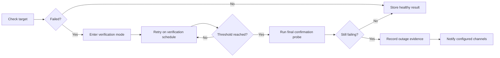
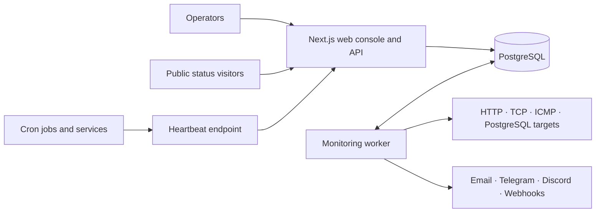

<h1 align="center">
  
</h1>

<p align="center">
  <strong>Self-hosted uptime monitoring for websites, APIs, and jobs.</strong><br>
  Check websites, APIs, ports, PostgreSQL databases, servers, and cron jobs. Sentrovia confirms failures before it sends an outage alert.
</p>

<p align="center">
  <a href="https://github.com/febroine/sentrovia-monitoring/actions/workflows/ci.yml"></a>
  <a href="https://github.com/febroine/sentrovia-monitoring/releases"></a>
  <a href="LICENSE"></a>
</p>

<p align="center">
  <a href="#quick-start">Quick Start</a> ·
  <a href="#features">Features</a> ·
  <a href="#how-outage-verification-works">Verification</a> ·
  <a href="#product-tour">Product Tour</a> ·
  <a href="docs/README.md">Documentation</a> ·
  <a href="CONTRIBUTING.md">Contributing</a>
</p>

<p align="center">
  <a href="docs/screenshots/demo-frames/01-dashboard.png">
    
  </a>
</p>

<p align="center"><sub>Sentrovia running with synthetic demo data.</sub></p>

## Self-hosted website and API monitoring

Sentrovia is an open-source uptime monitor you run on your own server. It checks whether your websites, APIs, and other services respond, then keeps the check history, alerts, and public status pages in your own PostgreSQL database. It is built for small teams that need to know what failed and whether an alert reached anyone.

One failed check does not automatically become an outage. Sentrovia retries it, checks the monitoring server's internet connection, and makes one final probe before notifying your team. A brief network hiccup is less likely to wake everyone up; a confirmed failure leaves a trail you can inspect.

## What you can monitor

| Check | What it covers |
| --- | --- |
| HTTP and HTTPS | Website uptime, response status, redirects, latency, and TLS behavior |
| API and JSON | Endpoint availability and expected values in a JSON response |
| Keyword | Required or unwanted text in an HTTP response |
| TCP port | Reachability of services such as SSH, SMTP, and custom applications |
| ICMP ping | Whether a server or network device responds to ping |
| PostgreSQL | Database connectivity, with configurable TLS verification |
| Cron and heartbeat | Jobs or services that report in on schedule |

Sentrovia checks reachability and response health. It does not collect host CPU, memory, disk, or network-traffic metrics.

## Features

- **Verified outage alerts:** set failure thresholds; the worker retries and confirms an outage before sending a down notification.
- **Evidence when a check fails:** review check history, response details, diagnostics, and timelines. Confirmed HTTP-style failures can also have a screenshot when capture is available.
- **Notification delivery history:** send email, Telegram, Discord, or webhook alerts and see which attempts succeeded, failed, or need a resend.
- **Public status pages:** share service availability without giving visitors access to the private console.
- **Uptime reports:** review availability and latency, schedule reports, and export HTML reports for a workspace or company.
- **Self-hosted deployment:** install with Docker Compose or run the web app and worker as Windows services. Administrator and member roles keep workspaces separate.

## Quick Start

### Docker Compose (recommended)

Requirements:

- Git
- Docker Engine with Docker Compose

The installer creates the private secrets, starts PostgreSQL, sets up the database, and launches the web app and monitoring worker.

Linux or macOS:

```bash
git clone https://github.com/febroine/sentrovia-monitoring.git
cd sentrovia-monitoring
chmod +x scripts/install-docker.sh
./scripts/install-docker.sh
```

Windows PowerShell:

```powershell
git clone https://github.com/febroine/sentrovia-monitoring.git
cd sentrovia-monitoring
Set-ExecutionPolicy -Scope Process Bypass
.\scripts\install-docker.ps1
```

Open [http://localhost:3000](http://localhost:3000), create the first administrator account, and add your first monitor.

### Windows services with NSSM

Requirements:

- Windows with an Administrator PowerShell session
- Git, Node.js 20.9 or newer, and npm
- NSSM available in `PATH`
- A PostgreSQL database with schema-change permissions

```powershell
git clone https://github.com/febroine/sentrovia-monitoring.git
cd sentrovia-monitoring
Set-ExecutionPolicy -Scope Process Bypass
.\scripts\install-windows-nssm.ps1
```

The installer creates `.env.local`, installs dependencies and Chromium, builds Sentrovia, sets up the database, and registers the `sentrovia-web` and `sentrovia-worker` services with automatic restart.

For HTTPS, reverse-proxy settings, remote PostgreSQL parameters, production Compose, updates, backups, and recovery, use the [deployment guide](docs/deployment.md).

## How Outage Verification Works


```mermaid
flowchart LR
    A["Check target"] --> B{"Failed?"}
    B -- "No" --> C["Store healthy result"]
    B -- "Yes" --> D["Enter verification mode"]
    D --> E["Retry on verification schedule"]
    E --> F{"Threshold reached?"}
    F -- "No" --> E
    F -- "Yes" --> G["Run final confirmation probe"]
    G --> H{"Still failing?"}
    H -- "No" --> C
    H -- "Yes" --> I["Record outage evidence"]
    I --> J["Notify configured channels"]
```

Before running checks, the worker tests its own internet connection against multiple independent public endpoints. If none is reachable, it pauses checks and notifications so a monitoring-server outage does not make every target look down. It resumes when the connection returns.

## Product Tour

<p align="center">
  
</p>

<p align="center"><sub>Dashboard, monitors, delivery history, reports, notification templates, and a public status page.</sub></p>

## Alerts and Evidence

For enabled email and Telegram alerts, Sentrovia sends to both monitor and assigned-company destinations. It removes duplicate email addresses and Telegram chats. Workspace destinations are used when neither the monitor nor its company defines that channel. Configure company recipients in **Companies → Edit company**. The **Check site** link in an email opens the monitored target, not the private Sentrovia console.

For confirmed HTTP, keyword, and JSON failures, Sentrovia tries to capture a screenshot. Alerts still go out if Chromium is unavailable. Test notifications use the configured channel and appear in delivery history, but do not count toward delivery health totals.

## Synthetic Demo Workspace

You can create a separate demo workspace to try the interface or take screenshots. It contains fictional companies and monitors, thirty days of check history, outages, delivery attempts, a report schedule, and a public status page. Its targets use reserved `.example` addresses, and their checks will not run.

Create a demo workspace with a unique identifier containing at least eight letters or numbers:

```bash
docker compose exec -e SENTROVIA_DEMO_RUN_ID=readme20260912 web node scripts/manage-demo-workspace.mjs create
```

The command prints temporary credentials and the public status page URL. Remove every record created for the identifier when finished:

```bash
docker compose exec -e SENTROVIA_DEMO_RUN_ID=readme20260912 web node scripts/manage-demo-workspace.mjs cleanup
```

The seed never runs during installation, startup, migration, or production updates.

## Deployment and Configuration

- **Docker Compose:** recommended for most installations. Follow the [Docker installation guide](docs/deployment.md#docker-compose).
- **Windows with NSSM:** runs Sentrovia as native Windows Server services without Docker. Follow the [Windows installation guide](docs/deployment.md#windows-services-with-nssm).

Tagged releases publish immutable source archives, SHA-256 checksums, build-provenance attestations, and versioned container images:

```bash
docker pull ghcr.io/febroine/sentrovia-monitoring:latest
```

Browse [GitHub Releases](https://github.com/febroine/sentrovia-monitoring/releases) for archives and checksums, or the [GitHub Container Registry package](https://github.com/febroine/sentrovia-monitoring/pkgs/container/sentrovia-monitoring) for published image tags.

### Updates

Pushing to `main` does not update running installations. A version tag publishes a stable GitHub Release after CI passes. For a Windows NSSM installation, open the updater from the **original installation directory**:

```bat
UPDATE-SENTROVIA.bat
```

This is the only user-facing BAT file. It requests Administrator access, then opens a window with the installed version, progress stages, and live output. After you confirm, it verifies the latest stable release, prepares it alongside the running version, and creates a verified encrypted PostgreSQL backup. It then stops both services, applies database migrations, starts the new version, and checks service and web health. If the switch fails, it attempts to restart the previous application version. **Database migrations are not automatically reversed**; keep the backup for manual recovery.

| Command | Purpose |
| --- | --- |
| `UPDATE-SENTROVIA.bat` | Graphical update |
| `UPDATE-SENTROVIA.bat --cli` | Command-line update |
| `UPDATE-SENTROVIA.bat --repair` | Database check and repair |

The BAT uses PowerShell and application scripts included in the installation; it is not a standalone copy of the application. Existing installations with an older launcher must [refresh it once](docs/deployment.md#windows-nssm-update). Docker updates use the separate [Docker update procedure](docs/deployment.md#docker-update).

Important configuration rules:

- Never commit `.env` or `.env.local`.
- Preserve `APP_ENCRYPTION_SECRET` with database backups; stored credentials and encrypted backups depend on it.
- Set a public HTTPS `APP_URL` in production.
- Enable proxy-header trust only behind a proxy that sanitizes forwarded headers.
- Set `MONITOR_ALLOW_PRIVATE_TARGETS=false` when the installation must not reach private networks.

See [deployment and configuration](docs/deployment.md) for the complete environment, update, backup, recovery, metrics, and release-verification guidance.

## Architecture


```mermaid
flowchart LR
    Operators["Operators"] --> Web["Next.js web console and API"]
    Visitors["Public status visitors"] --> Web
    Jobs["Cron jobs and services"] --> Heartbeat["Heartbeat endpoint"]
    Heartbeat --> Web
    Web --> DB[("PostgreSQL")]
    Worker["Monitoring worker"] --> Targets["HTTP · TCP · ICMP · PostgreSQL targets"]
    Worker --> Channels["Email · Telegram · Discord · Webhooks"]
    Worker <--> DB
```

The web service owns the interface, authenticated API, public status pages, and heartbeat intake. The worker claims due checks, verifies failures, stores results, and processes notification and report delivery. PostgreSQL is the shared durable state.

## Local Development

Requirements: Node.js 20.9 or newer, npm, PostgreSQL 16, and Playwright Chromium for screenshot tests.

Configure a private `.env.local` with strong local-only secrets and either `DATABASE_URL` or the `POSTGRES_*` values from [.env.example](.env.example). Then run:

```bash
npm ci
npm run db:sync
npm run dev
```

Start the worker in another terminal:

```bash
npm run worker:dev
```

Run the same checks as CI:

```bash
npx playwright install chromium
npm test
npm run lint
npm run typecheck
npm run benchmark:scale
npm run build
```

The dynamic browser suite covers authenticated routes, API boundaries, critical UI interactions, responsive overflow, reports, status pages, and notification previews. See the [dynamic E2E test cases](docs/dynamic-e2e-test-cases.md).

## Documentation

- [Documentation index](docs/README.md)
- [Deployment, configuration, updates, and recovery](docs/deployment.md)
- [Scale benchmark methodology](docs/scale-benchmarks.md)
- [Dynamic end-to-end test cases](docs/dynamic-e2e-test-cases.md)
- [Changelog](CHANGELOG.md)
- [Contributing guide](CONTRIBUTING.md)
- [Security policy](SECURITY.md)

## Roadmap

Sentrovia is usable today as an internal website and API uptime monitoring console. Planned areas include multi-region workers, DNS-specific monitors, and a hosted read-only demo. These are roadmap items, not current features.

Feature proposals are welcome through the [issue tracker](https://github.com/febroine/sentrovia-monitoring/issues), but large changes should be discussed before implementation.

## Contributing

Focused bug fixes, tests, documentation improvements, and well-scoped product changes are welcome. Read [CONTRIBUTING.md](CONTRIBUTING.md) for the development setup, validation commands, and pull-request expectations.

## Security

Report suspected vulnerabilities privately through the process in [SECURITY.md](SECURITY.md). Do not include credentials, private monitor targets, customer data, or database contents in a public issue.

## License

Sentrovia is open source under the [MIT License](LICENSE).
