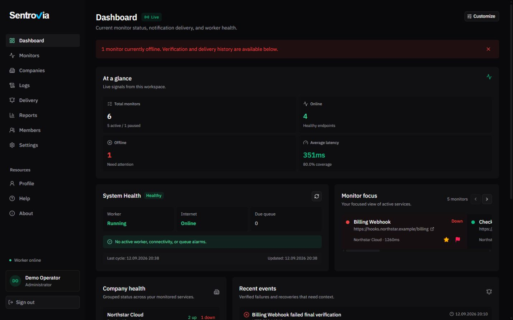
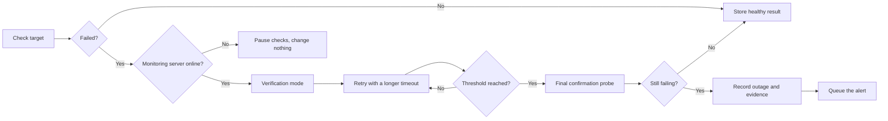
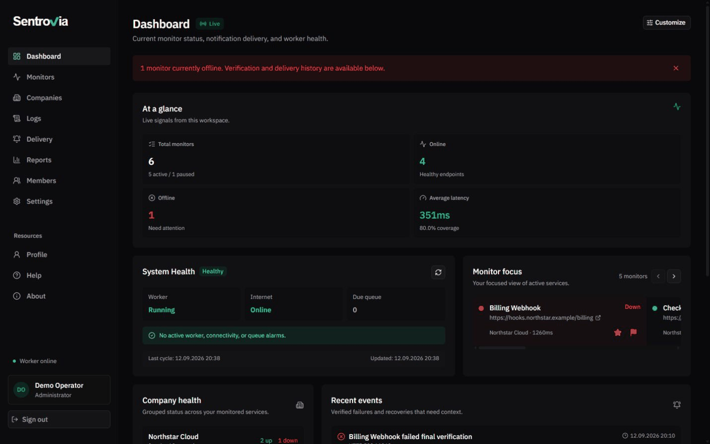
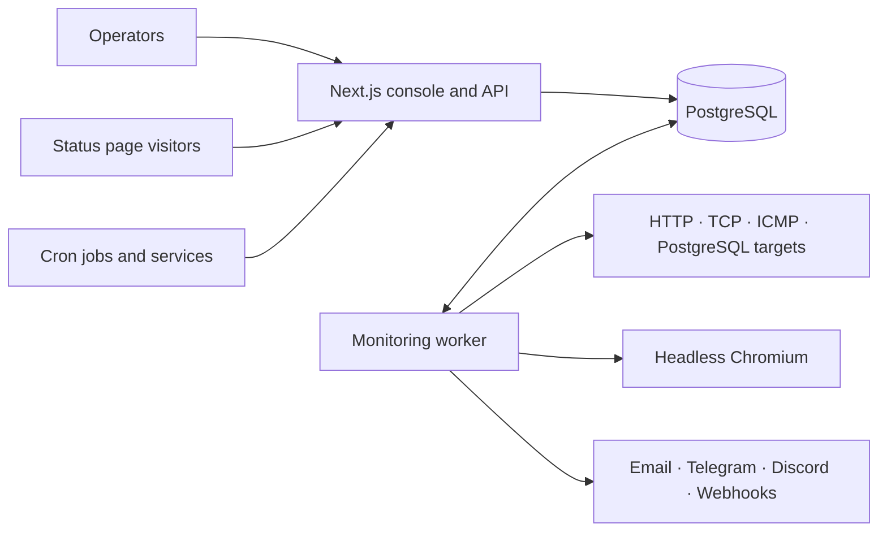

<h1 align="center">
  
</h1>

<p align="center">
  <strong>Self-hosted uptime monitoring for websites, APIs, and scheduled jobs.</strong><br>
  Sentrovia confirms a failure before it alerts you, and shows you what the failed check saw.
</p>

<p align="center">
  <a href="https://github.com/febroine/sentrovia-monitoring/actions/workflows/ci.yml"></a>
  <a href="https://github.com/febroine/sentrovia-monitoring/releases"></a>
  <a href="LICENSE"></a>
</p>

<p align="center">
  <a href="#quick-start">Quick Start</a> ·
  <a href="#features">Features</a> ·
  <a href="#how-outage-verification-works">Verification</a> ·
  <a href="#alerts-screenshots-and-failure-evidence">Evidence</a> ·
  <a href="#configuration">Configuration</a> ·
  <a href="#faq">FAQ</a> ·
  <a href="docs/README.md">Documentation</a>
</p>

<p align="center">
  <a href="docs/screenshots/demo-frames/01-dashboard.png">
    
  </a>
</p>

<p align="center"><sub>Sentrovia running with synthetic demo data.</sub></p>

## Self-hosted website and API monitoring

Sentrovia is an open-source uptime monitor that you run on your own server. It checks that your websites, APIs, ports, databases, and cron jobs respond. Check history, alerts, and public status pages stay in your own PostgreSQL database.

It is built for small teams that care about two things: **not being woken up by false alarms**, and **knowing exactly what failed** when an alert does arrive.

- **One failed check is not an outage.** Sentrovia retries with longer timeouts, makes sure the monitoring server itself is online, and runs a final probe before it sends a down alert.
- **Every alert comes with evidence.** Outage emails carry a real browser screenshot of the page. The console shows what the failed check saw: the server address, how long each connection step took, where it stopped, response headers, and the start of the response body.
- **You can see that the alert arrived.** Every email, Telegram, Discord, and webhook delivery is recorded with its outcome, so a silent failure of the alert itself does not go unnoticed.

## What you can monitor

| Check | What it covers |
| --- | --- |
| HTTP and HTTPS | Website uptime, status codes, redirects, response time, and TLS certificate expiry |
| API and JSON | Endpoint availability and an expected value at a JSON path |
| Keyword | Text that must, or must not, appear in a response |
| TCP port | Reachability of services such as SSH, SMTP, or your own applications |
| ICMP ping | Whether a server or network device answers ping |
| DNS record | A, AAAA, CNAME, MX, TXT, or NS records, optionally checked against expected values or a specific DNS server |
| PostgreSQL | Database connectivity, with configurable TLS verification |
| Cron and heartbeat | Jobs and services that must report in on schedule |

Sentrovia checks reachability and response health. It does not collect CPU, memory, disk, or network-traffic metrics from your hosts.

## Features

**Fewer false alarms**
- Configurable failure thresholds. Each verification retry gets more time, up to twice the monitor timeout.
- A connectivity check against several independent public endpoints. If the monitoring server is offline, checks pause instead of reporting every site as down.
- A final confirmation probe just before the outage is declared.
- Checks identify as a desktop browser, so firewalls and bot filters do not mistake them for attacks and block them.

**Evidence for every failure**
- Real Chromium screenshots of failing pages, with a banner that compares what the check and the browser saw.
- A "What the check saw" panel for every failed check in the timeline.
- Per-check history, diagnostics, and an outage timeline.
- A 90-day calendar of daily availability for each monitor, in the workspace time zone.

**Alerts that reach people**
- Channels: email, Telegram, Discord, and webhooks.
- Optional desktop notifications and an alert sound while the console is open (Profile → Alerts, per browser).
- Per-monitor and per-company recipients, with duplicate addresses removed. A company address can be limited to selected monitors.
- Editable templates in English or Turkish.
- Delivery history with retries and resend.
- Alerts are sent from a durable queue, in order, and never twice.

**Status pages and reports**
- Public status pages that do not expose the private console.
- Availability and latency reports, scheduled by email or exported as HTML, per workspace or company.

**Built to run unattended**
- Independent worker slots, so one slow site never delays the others.
- Live worker health in the console and Prometheus metrics.
- Encrypted automatic database backups and a guided updater.

**Self-hosted**
- Install with Docker Compose, or run the web app and worker as Windows services.
- Administrator and member roles keep workspaces separate.

## Quick Start

### Docker Compose (recommended)

Requirements: Git and Docker Engine with Docker Compose.

The installer creates the private secrets, starts PostgreSQL, sets up the database, and launches the web app and the monitoring worker.

Linux or macOS:

```bash
git clone https://github.com/febroine/sentrovia-monitoring.git
cd sentrovia-monitoring
chmod +x scripts/install-docker.sh
./scripts/install-docker.sh
```

Windows PowerShell:

```powershell
git clone https://github.com/febroine/sentrovia-monitoring.git
cd sentrovia-monitoring
Set-ExecutionPolicy -Scope Process Bypass
.\scripts\install-docker.ps1
```

Open [http://localhost:3000](http://localhost:3000), create the first administrator account, and add your first monitor.

### Windows services with NSSM

Requirements:

- Windows with an Administrator PowerShell session
- Git, Node.js 20.9 or newer, and npm
- NSSM available in `PATH`
- A PostgreSQL database with schema-change permissions

```powershell
git clone https://github.com/febroine/sentrovia-monitoring.git
cd sentrovia-monitoring
Set-ExecutionPolicy -Scope Process Bypass
.\scripts\install-windows-nssm.ps1
```

The installer creates `.env.local`, installs dependencies and Chromium, builds Sentrovia, sets up the database, and registers the `sentrovia-web` and `sentrovia-worker` services with automatic restart.

For HTTPS, reverse proxies, remote PostgreSQL, the production Compose profile, updates, backups, and recovery, see the [deployment guide](docs/deployment.md).

## How Outage Verification Works


```mermaid
flowchart LR
    A["Check target"] --> B{"Failed?"}
    B -- "No" --> C["Store healthy result"]
    B -- "Yes" --> K{"Monitoring server online?"}
    K -- "No" --> P["Pause checks, change nothing"]
    K -- "Yes" --> D["Verification mode"]
    D --> E["Retry with a longer timeout"]
    E --> F{"Threshold reached?"}
    F -- "No" --> E
    F -- "Yes" --> G["Final confirmation probe"]
    G --> H{"Still failing?"}
    H -- "No" --> C
    H -- "Yes" --> I["Record outage and evidence"]
    I --> J["Queue the alert"]
```

1. **First failure.** The monitor enters verification mode and is rechecked every minute. Each retry gets more time, up to twice the monitor timeout, so a slow but working site is not reported as down.
2. **Connectivity check.** Before a failure counts, the worker tests its own internet access against several independent public endpoints. If none answers, the problem is on the monitoring side: checks pause and no monitor changes state.
3. **Final probe.** When the failure threshold is reached, one more probe runs. If it succeeds, the monitor returns to healthy and no alert is sent.
4. **Confirmed outage.** The outage, its diagnostics, and what the check saw are recorded, and the alert is queued for delivery.

## Alerts, Screenshots, and Failure Evidence

### Notification queue

The check only records an alert. A separate set of worker slots takes the screenshot and delivers the alert, so a slow site or a slow mail server never delays the next check.

- **Order.** Alerts for one monitor are delivered in the order they were raised; a recovery never arrives before its outage alert.
- **No duplicates.** A queued outage alert or reminder is never queued twice.
- **Retries.** An alert that fails with an error is retried with backoff.
- **Crash safety.** If the worker stops mid-delivery, the alert is not sent a second time.

The queue's backlog is visible in **Worker Pulse** and in Prometheus.

### Outage screenshots

For HTTP, keyword, and JSON monitors, an outage alert can include a screenshot. It is the site as headless Chromium sees it when the alert is sent, never a generated image.

**What the screenshot shows**
- When a page cannot be loaded at all, you get the browser's own error page, such as "connection refused", a DNS failure, or a certificate error.
- A slow page is given as long as the monitor timeout (up to 60 seconds). If it is still loading, it is captured as it is.
- A banner across the top shows how long the page took, the HTTP status the check got next to the one the browser got, and how long after the failed check the picture was taken.
- The banner is written in the alert's language.

**When the screenshot is left out**
- If the site already answers normally by the time the screenshot is taken, the screenshot is left out, so you never see a working page next to an outage alert. The log records why.
- The alert is still sent when Chromium is unavailable; the log records why the screenshot is missing.

The number of browsers used at once is set with `SCREENSHOT_CONCURRENCY`.

### What the check saw

Every failed HTTP, keyword, or JSON check records what it saw at the moment it failed. Open a failed check in the monitor timeline to see it:

- **Server address.** The IP address and port that were dialled, even when the connection never succeeded.
- **Step timings.** DNS, connect, TLS handshake, and first byte, plus the step where the check stopped.
- **Redirects and headers.** The redirect chain, and response headers that show who answered: `server`, `cf-ray`, `x-cache`, `via`, `retry-after`.
- **Certificate.** Its details, including a certificate the check rejected.
- **Response body.** The first 2,000 characters as readable text.

Cookies, request headers, and anything that looks like a password, token, or key are never stored.

Outage emails and Telegram messages carry a one-line summary of these details, without the response body, for example:

```text
Check details: 203.0.113.10:443 · DNS 4 ms · connect 20 ms · TLS 31 ms · stopped while waiting for the first byte · server: nginx
```

To place this line yourself, use the `{check_details}` placeholder in a notification template.

### Recipients

Email and Telegram alerts go to both the monitor's and its company's destinations, with duplicate addresses and chats removed. Workspace destinations are used when neither defines a channel. Configure company recipients in **Companies → Edit company**.

A company email address can cover all of the company's monitors (the default) or only selected ones. For example, `ops@` can receive every alert while `manager@` receives only the alerts of three critical sites. The company's monitor list shows who receives each monitor's alerts. A monitor that no address covers falls back to its own recipients or the workspace address, so an alert is never dropped.

The **Check site** link in an email opens the monitored target, never the private console. Test notifications appear in delivery history but do not count toward delivery health.

## Product Tour

<p align="center">
  
</p>

<p align="center"><sub>Dashboard, monitors, delivery history, reports, notification templates, and a public status page.</sub></p>

## Configuration

Sentrovia reads its settings from `.env` (Docker) or `.env.local` (Windows services). [.env.example](.env.example) lists every option.

| Variable | Default | Purpose |
| --- | --- | --- |
| `APP_URL` | `http://localhost:3000` | Public URL of the console; use HTTPS in production |
| `APP_ENCRYPTION_SECRET` | created by the installer | Encrypts stored credentials and backups; keep it with your backups |
| `WORKER_CONCURRENCY` | `20` | Checks that run at the same time |
| `WORKER_POLL_INTERVAL_MS` | `10000` | How often the worker looks for due monitors |
| `SCREENSHOT_CONCURRENCY` | `3` | Chromium browsers used at once for outage screenshots (1-10); each uses roughly 150-300 MB of memory |
| `WORKER_CONNECTIVITY_CHECK_ENABLED` | `true` | Pause checks when the monitoring server itself is offline |
| `MONITOR_ALLOW_PRIVATE_TARGETS` | `true` | Allow administrators' monitors to reach private networks; set `false` to block |
| `METRICS_AUTH_TOKEN` | empty | Enables the Prometheus endpoint (at least 32 characters) |

Important rules:

- Never commit `.env` or `.env.local`.
- Keep `APP_ENCRYPTION_SECRET` with your database backups; stored credentials and encrypted backups cannot be read without it.
- Enable proxy-header trust only behind a proxy that sanitizes forwarded headers.

### Monitoring the monitor

**Worker Pulse** in the console shows the worker's heartbeat, the longest time a due monitor has waited for a free slot, the average and maximum check delay, and how many alerts are waiting to be sent. It warns when either wait grows too long.

With `METRICS_AUTH_TOKEN` set, `GET /api/metrics` exposes the same signals to Prometheus. They include:

- worker health,
- monitor status and backlog,
- `sentrovia_monitors_oldest_due_seconds`,
- `sentrovia_notifications_queued` and `sentrovia_notifications_oldest_queued_seconds`,
- delivery outcomes,
- backup state.

See [Prometheus metrics](docs/deployment.md#prometheus-metrics).

## Deployment, Releases, and Updates

Tagged releases publish immutable source archives, SHA-256 checksums, build-provenance attestations, and versioned container images:

```bash
docker pull ghcr.io/febroine/sentrovia-monitoring:latest
```

Browse [GitHub Releases](https://github.com/febroine/sentrovia-monitoring/releases) for archives and checksums, or the [container package](https://github.com/febroine/sentrovia-monitoring/pkgs/container/sentrovia-monitoring) for image tags.

Pushing to `main` does not update running installations. A version tag publishes a stable release after CI passes.

**Docker.** Follow the [Docker update procedure](docs/deployment.md#docker-update).

**Windows (NSSM).** Run the updater from the **original installation directory**:

```bat
UPDATE-SENTROVIA.bat
```

It requests Administrator access and shows the installed version, progress, and live output. It then:

1. verifies the latest stable release and prepares it alongside the running version,
2. creates a verified, encrypted PostgreSQL backup,
3. stops both services, applies database migrations, and starts the new version,
4. checks service and web health.

If the switch fails, it tries to restart the previous version. **Database migrations are not reversed automatically**, so keep the backup for manual recovery.

| Command | Purpose |
| --- | --- |
| `UPDATE-SENTROVIA.bat` | Graphical update |
| `UPDATE-SENTROVIA.bat --cli` | Command-line update |
| `UPDATE-SENTROVIA.bat --repair` | Database check and repair |

Installations with an older launcher must [refresh it once](docs/deployment.md#windows-nssm-update).

## Synthetic Demo Workspace

Create a separate demo workspace to try the interface or take screenshots. It contains:

- fictional companies and monitors,
- thirty days of check history,
- outages and delivery attempts,
- a report schedule and a public status page.

Its targets use reserved `.example` addresses, so their checks never run.

Use a unique identifier with at least eight letters or numbers:

```bash
docker compose exec -e SENTROVIA_DEMO_RUN_ID=readme20260912 web node scripts/manage-demo-workspace.mjs create
```

The command prints temporary credentials and the status page URL. Remove everything created for the identifier when finished:

```bash
docker compose exec -e SENTROVIA_DEMO_RUN_ID=readme20260912 web node scripts/manage-demo-workspace.mjs cleanup
```

The demo data is never created during installation, startup, migration, or updates.

## Architecture


```mermaid
flowchart LR
    Operators["Operators"] --> Web["Next.js console and API"]
    Visitors["Status page visitors"] --> Web
    Jobs["Cron jobs and services"] --> Web
    Web --> DB[("PostgreSQL")]
    Worker["Monitoring worker"] <--> DB
    Worker --> Targets["HTTP · TCP · ICMP · PostgreSQL targets"]
    Worker --> Browser["Headless Chromium"]
    Worker --> Channels["Email · Telegram · Discord · Webhooks"]
```

**Web service.** It serves the console, the authenticated API, public status pages, and heartbeat intake.

**Worker.** It claims due monitors into independent check slots, verifies failures, and records results and evidence. It sends queued alerts from separate notification slots and runs scheduled reports, backups, and retention cleanup.

**PostgreSQL.** It holds all durable state, including the notification queue. Monitors and alerts are claimed with leases in the database, so a check or an alert is never processed twice, even across a worker restart. Only one worker process runs at a time.

## Local Development

Requirements: Node.js 20.9 or newer, npm, PostgreSQL 16, and Playwright Chromium for screenshot tests.

Configure a private `.env.local` with strong local-only secrets and either `DATABASE_URL` or the `POSTGRES_*` values from [.env.example](.env.example). Then:

```bash
npm ci
npm run db:sync
npm run dev
```

Start the worker in another terminal:

```bash
npm run worker:dev
```

Run the same checks as CI:

```bash
npx playwright install chromium
npm test
npm run lint
npm run typecheck
npm run benchmark:scale
npm run build
```

The dynamic browser suite covers authenticated routes, API boundaries, critical UI interactions, responsive layout, reports, status pages, and notification previews. See the [dynamic E2E test cases](docs/dynamic-e2e-test-cases.md).

## FAQ

### Does Sentrovia alert on a single failed check?

No. A failed check starts verification. You are alerted only after the failure threshold is reached and a final probe still fails. A connectivity check first makes sure the failure is not on the monitoring server's side.

### Is the screenshot in an alert a real picture of my site?

Yes. It is taken by headless Chromium from the monitoring server when the alert is sent. Sentrovia only adds the banner at the top. If the browser cannot draw the page, the alert is sent without a screenshot; it never contains a generated image.

### What data leaves my server?

Sentrovia sends only the checks themselves and the alerts you configure. The checks go to your targets, and the connectivity check contacts a few public endpoints, which you can change or disable. The alerts go to your mail server, Telegram, Discord, or your webhooks. Opening the update page in the console asks GitHub for the latest release. Sentrovia has no analytics or usage tracking, and there is no hosted service.

### Can it monitor internal services?

Yes. Administrators' monitors may reach private networks unless `MONITOR_ALLOW_PRIVATE_TARGETS=false`. Members' monitors are limited to public addresses.

### Does it monitor CPU, memory, or disk usage?

No. Sentrovia checks whether services respond and how. Use a metrics agent for host resources.

### Which languages are supported?

The console is in English. Notification emails, Telegram messages, and screenshot banners can be sent in English or Turkish, per workspace or per monitor.

## Documentation

- [Documentation index](docs/README.md)
- [Deployment, configuration, updates, and recovery](docs/deployment.md)
- [Scale benchmark methodology](docs/scale-benchmarks.md)
- [Dynamic end-to-end test cases](docs/dynamic-e2e-test-cases.md)
- [Changelog](CHANGELOG.md)
- [Contributing guide](CONTRIBUTING.md)
- [Security policy](SECURITY.md)

## Roadmap

Sentrovia is usable today as a self-hosted website and API uptime monitoring console. Planned areas include multi-region workers and a hosted read-only demo. These are roadmap items, not current features.

Feature proposals are welcome through the [issue tracker](https://github.com/febroine/sentrovia-monitoring/issues). Please discuss large changes before implementing them.

## Contributing

Focused bug fixes, tests, documentation improvements, and well-scoped product changes are welcome. Read [CONTRIBUTING.md](CONTRIBUTING.md) for the development setup, validation commands, and pull-request expectations.

## Security

Report suspected vulnerabilities privately through the process in [SECURITY.md](SECURITY.md). Do not include credentials, private monitor targets, customer data, or database contents in a public issue.

## License

Sentrovia is open source under the [MIT License](LICENSE).
